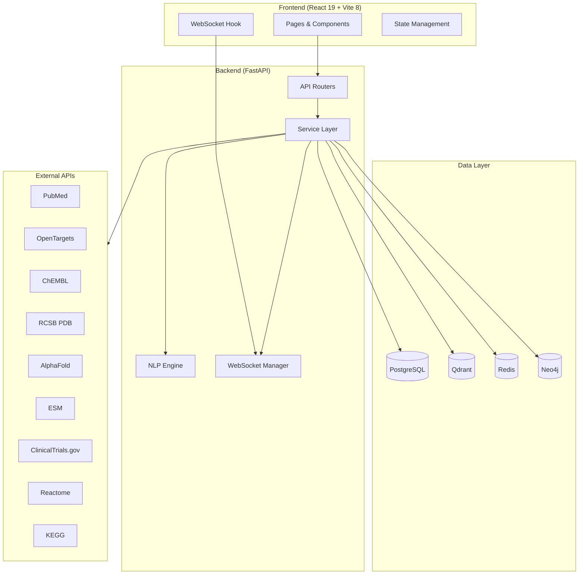
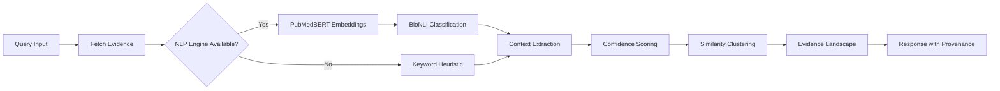
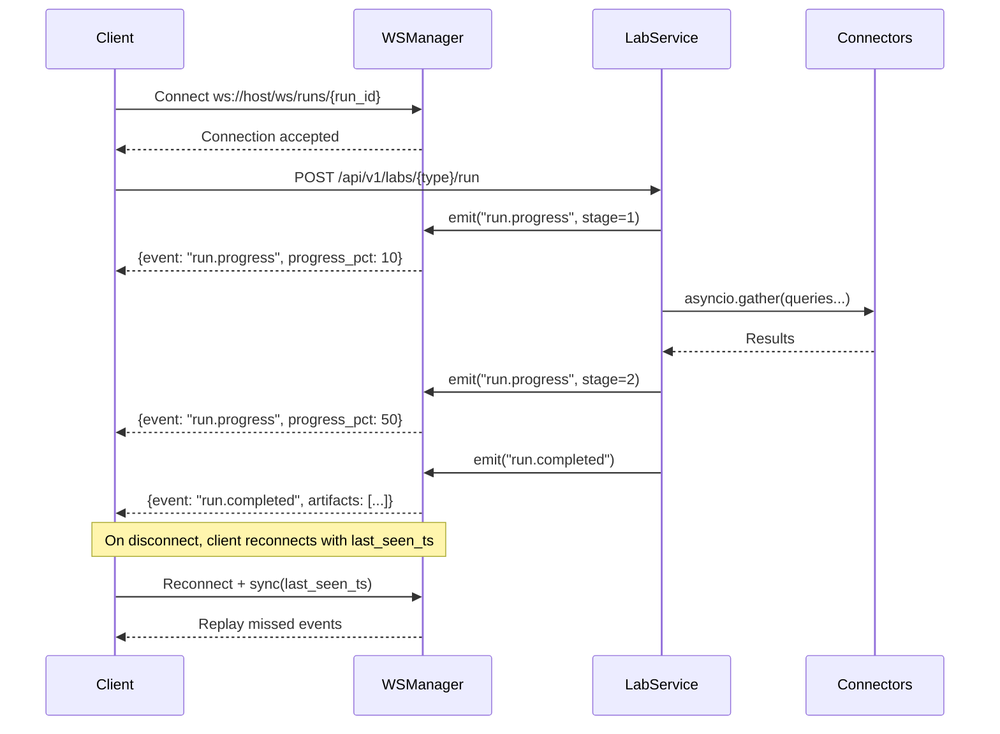

# Design Document — Drug Designer Codebase Alignment

## Overview

This design addresses 12 critical functional gaps in the Drug Designer platform, transforming it from ~35% functional scaffolding into a production-grade biomedical research tool. The implementation spans the full stack: FastAPI backend services, React 19 frontend components, real-time WebSocket communication, and integration with 158+ scientific API connectors.

**Key Design Principles:**
- **Graceful degradation**: Every feature works with reduced capability when optional dependencies (ML models, external tools) are unavailable
- **Provenance-first**: Every data point traces back to its source with timestamps and confidence scores
- **Contradiction-aware**: The platform never silently flattens conflicting evidence
- **Lazy initialization**: Heavy ML models load on first use, not at startup
- **Parallel execution**: Connector calls use `asyncio.gather` for maximum throughput

## Architecture

### High-Level System Architecture



### NLP Contradiction Pipeline Architecture



### WebSocket Real-Time Progress Flow



## Components and Interfaces

### Backend Components

#### 1. NLP Contradiction Engine (`services/nlp_contradiction_engine.py`)

Already implemented. Key interface:

```python
class NLPContradictionEngine:
    async def initialize() -> None  # Lazy-load PubMedBERT + BioNLI
    def compute_similarity(text_a: str, text_b: str) -> float  # Cosine or Jaccard fallback
    def classify_pair(premise: str, hypothesis: str) -> NLIResult  # NLI or keyword fallback
    def extract_context(text: str) -> ExperimentalContext  # Regex-based context extraction
    def compute_confidence(nli_score, context_alignment, source_quality) -> float
    def get_method_used() -> Literal["nlp", "keyword_fallback"]
```

#### 2. Enhanced Lab Computation Services (`services/labs/`)

Each lab gets a dedicated computation module:

```python
# services/labs/target_discovery.py
class TargetDiscoveryComputation:
    async def execute(input_data: dict, ws_manager: WebSocketManager, run_id: str) -> LabResult:
        """
        1. Query OpenTargets, DisGeNET, UniProt in parallel
        2. Score targets using TargetScorer
        3. Build PPI network from STRING/IntAct
        4. Emit progress events at each stage
        5. Return ranked targets with provenance
        """

# services/labs/pocket_detection.py
class PocketDetectionComputation:
    async def execute(input_data: dict, ws_manager, run_id) -> LabResult:
        """
        1. Download PDB file from RCSB
        2. Execute fpocket/p2rank binary
        3. Parse pocket output (residues, coordinates, scores)
        4. Rank by druggability score
        5. Return with provenance
        """

# services/labs/admet_computation.py
class ADMETComputation:
    async def execute(input_data: dict, ws_manager, run_id) -> LabResult:
        """
        1. Parse SMILES list
        2. Compute RDKit descriptors (MW, LogP, TPSA, HBD, HBA, RotBonds)
        3. Run ADMETPredictor with conformal prediction
        4. Return predictions with confidence intervals
        """
```

#### 3. Graph Service Enhancement (`services/graph_service.py`)

```python
class EnhancedGraphService(GraphService):
    async def build_knowledge_graph(entity_ids: List[str], depth: int = 2) -> KnowledgeGraph:
        """
        1. Fetch entity data from connectors
        2. Build nodes with ENTITY_COLORS and centrality
        3. Build edges with reason, evidence_ids, relationship_type
        4. Compute betweenness centrality via networkx
        5. Return graph with full metadata
        """

    async def get_edge_detail(edge_id: str) -> EdgeDetail:
        """Return full evidence items for a specific edge."""
```

#### 4. Clinical Workflow Engine (`services/clinical/workflow_engine.py`)

```python
class ClinicalWorkflowEngine:
    async def attempt_step(workflow_id: str, step_number: int, payload: StepPayload) -> StepResult:
        """
        1. Validate steps 1..N-1 are completed or skipped
        2. Validate evidence_ids is non-empty (for completion)
        3. Validate justification is non-empty (for skip)
        4. Execute step computation
        5. Persist state to PostgreSQL
        6. Emit WebSocket progress
        """

    async def generate_go_nogo(workflow_id: str) -> GoNoGoSummary:
        """Aggregate all step outputs into decision summary."""
```

#### 5. Debate Engine (`services/syntharena/debate.py`)

```python
class DebateEngine:
    SPECIALIST_ROLES = [
        "Medicinal Chemist",
        "Toxicologist", 
        "Clinical Pharmacologist",
    ]

    async def run_debate(session: SynthArenaSession, compounds: List[Compound]) -> DebateResult:
        """
        1. Create specialist agents with distinct roles
        2. Each agent generates evidence-backed arguments
        3. Arguments cite specific data (IC50, LD50, clinical outcomes)
        4. Compute consensus from agent votes
        5. Generate winner rationale with dissenting opinions
        Fallback: rule-based scoring when LLM unavailable
        """
```

#### 6. Dossier Generator (`services/dossier_generator.py`)

```python
class DossierGenerator:
    async def generate(session_id: str) -> Dossier:
        """
        Sections: Executive Summary, Compound Comparison, Scoring Matrix,
        Debate Summary, Recommendation, Provenance Appendix
        """

    async def export_pdf(dossier: Dossier) -> bytes:
        """WeasyPrint HTML→PDF with Jinja2 templates."""

    async def export_docx(dossier: Dossier) -> bytes:
        """python-docx structured document generation."""
```

### Frontend Components

#### 7. EntityDetailDrawer (`components/entity/EntityDetailDrawer.tsx`)

```typescript
interface EntityDetailDrawerProps {
  entityId: string;
  entityType: EntityType;
  isOpen: boolean;
  onClose: () => void;
}

// Tabs: Overview | Publications | Clinical Trials | Related Entities | Actions
// Actions build Handoff_Payload and navigate via router
```

#### 8. Enhanced ForceGraph (`components/graph/ForceGraph.tsx`)

```typescript
interface ForceGraphProps {
  nodes: GraphNode[];  // includes color from ENTITY_COLORS, size from centrality
  edges: GraphEdge[];  // includes reason, evidence_ids, relationship_type
  onEdgeClick: (edge: GraphEdge) => void;
  onNodeClick: (node: GraphNode) => void;
  mode: "default" | "ppi";
}
```

#### 9. Pathway Popovers (`components/pathways/PathwayNodePopover.tsx`)

```typescript
interface PathwayNodePopoverProps {
  node: PathwayNode;  // includes source_db, source_url, explanation, evidence[]
  position: { x: number; y: number };
}

interface PathwayEdgePopoverProps {
  edge: PathwayEdge;  // includes type, source_db, explanation, evidence[]
  position: { x: number; y: number };
}
```

#### 10. Structure Viewer Sub-Tabs (`pages/StructurePage.tsx`)

```typescript
// 7 sub-tabs as child components:
// StructureSummaryTab, Structure3DTab, BindingSitesTab,
// AnnotationsTab, SequenceTab, GenomeTab, ComparisonTab

interface StructurePageState {
  activeTab: "summary" | "3d" | "binding-sites" | "annotations" | "sequence" | "genome" | "comparison";
  structureData: StructureData | null;
  source: "esm" | "alphafold" | "rcsb";  // which source provided the data
}
```

## Data Models

### Lab Result Model

```python
class LabResult(BaseModel):
    run_id: str
    lab_type: str  # target-discovery, pocket, molecule-generation, admet, retrosynthesis, vaccine, metabolic, pharmacogenomics
    status: Literal["success", "degraded", "error"]
    artifacts: List[Dict[str, Any]]  # Lab-specific structured data
    provenance: ProvenanceChain
    warnings: List[str] = []
    computation_time_ms: int

class ProvenanceChain(BaseModel):
    sources_queried: List[str]
    sources_succeeded: List[str]
    sources_degraded: List[str]
    computation_time_ms: int
    generated_at: str  # ISO 8601
```

### Knowledge Graph Models

```python
class GraphNode(BaseModel):
    id: str
    label: str
    type: EntityType  # protein, gene, disease, drug, compound, pathway, publication, clinical_trial, variant
    color: str  # Hex from ENTITY_COLORS
    size: float  # 0.5 + centrality * 2.0
    metadata: Dict[str, Any]

class GraphEdge(BaseModel):
    source: str
    target: str
    label: str
    weight: float
    reason: str  # Non-empty, human-readable explanation
    evidence_ids: List[str]  # At least one
    relationship_type: str  # physical_interaction, genetic_association, pathway_membership, etc.
    source_db: str
    confidence: float
```

### Debate Engine Models

```python
class DebateAgent(BaseModel):
    agent_id: str
    role: str  # "Medicinal Chemist", "Toxicologist", "Clinical Pharmacologist"
    stance: Literal["for", "against", "neutral"]

class DebateArgument(BaseModel):
    agent_id: str
    role: str
    stance: str
    argument_text: str
    evidence_citations: List[EvidenceCitation]  # At least one
    confidence: float
    round_number: int

class DebateResult(BaseModel):
    debate_id: str
    session_id: str
    agents: List[DebateAgent]  # >= 3
    debate_history: List[DebateArgument]
    consensus: DebateConsensus
    method_used: Literal["llm", "rule_based"]

class DebateConsensus(BaseModel):
    winner_compound_id: str
    winner_rationale: str
    confidence: float
    dissenting_opinions: List[Dict[str, Any]]
    vote_breakdown: Dict[str, str]  # agent_id -> compound_id
```

### Clinical Workflow Models

```python
class WorkflowStep(BaseModel):
    step_number: int  # 1-10
    step_name: str
    status: Literal["pending", "in_progress", "completed", "skipped"]
    evidence_ids: List[str] = []  # Required for completion (>= 1)
    skip_justification: Optional[str] = None  # Required for skip
    outputs: Dict[str, Any] = {}
    completed_at: Optional[str] = None

class ClinicalWorkflow(BaseModel):
    workflow_id: str
    project_id: str
    steps: List[WorkflowStep]  # Exactly 10
    current_step: int  # 1-10
    go_nogo_summary: Optional[GoNoGoSummary] = None
```

### Dossier Generation Models

```python
class DossierContent(BaseModel):
    executive_summary: str
    compound_comparison: Dict[str, Any]
    scoring_matrix: List[Dict[str, Any]]
    debate_summary: Dict[str, Any]
    recommendation: str
    provenance_appendix: ProvenanceAppendix

class ProvenanceAppendix(BaseModel):
    sources_consulted: List[SourceEntry]
    total_sources: int
    generated_at: str
    method_used: str
```

### Entity Detail Models

```python
class EntityDetail(BaseModel):
    entity_id: str
    entity_type: EntityType
    entity_name: str
    identifiers: Dict[str, str]  # uniprot, ensembl, hgnc, chembl, etc.
    ai_overview: str
    publications: List[Publication]
    clinical_trials: List[ClinicalTrial]
    related_entities: List[RelatedEntity]
    actions: List[EntityAction]

class EntityAction(BaseModel):
    action_id: str
    label: str
    target_route: str
    enabled: bool
    handoff_payload: Dict[str, Any]
```

## Correctness Properties

*A property is a characteristic or behavior that should hold true across all valid executions of a system — essentially, a formal statement about what the system should do. Properties serve as the bridge between human-readable specifications and machine-verifiable correctness guarantees.*

### Property 1: NLI Classification Output Structure

*For any* two text strings provided to `classify_pair()`, the returned `NLIResult` SHALL contain a `label` in {"entailment", "contradiction", "neutral"}, a `confidence` in [0.0, 1.0], and a `method` in {"nli_model", "keyword_heuristic"}.

**Validates: Requirements 1.3**

### Property 2: Similarity Clustering Respects Threshold

*For any* set of claims and any configured threshold T, every pair of claims within the same similarity cluster SHALL have a computed similarity score >= T.

**Validates: Requirements 1.4**

### Property 3: Analysis Response Method Field

*For any* query input to `analyze_contradictions_and_similarities()`, the response SHALL contain a top-level `method_used` field with value "nlp" or "keyword_fallback", and this value SHALL match the NLP engine's availability state at time of execution.

**Validates: Requirements 1.1, 1.7**

### Property 4: ADMET Predictions Include Confidence Intervals

*For any* valid SMILES string submitted to the ADMET lab, the prediction result SHALL include all 5 ADMET categories (absorption, distribution, metabolism, excretion, toxicity) each with a confidence interval where lower_bound <= prediction <= upper_bound and both bounds are in [0.0, 1.0].

**Validates: Requirements 2.4**

### Property 5: Lab Response Provenance Invariant

*For any* lab run that completes (regardless of lab type or input), the response SHALL include a `provenance` object with non-empty `sources_queried` array, `sources_succeeded` array (subset of sources_queried), `sources_degraded` array (subset of sources_queried), and `generated_at` ISO timestamp.

**Validates: Requirements 2.9, 12.1, 12.5**

### Property 6: Node Color Mapping Invariant

*For any* node in a Knowledge Graph with `type` in the set {protein, gene, disease, drug, compound, pathway, publication, clinical_trial, variant}, the node's `color` field SHALL equal the corresponding value from ENTITY_COLORS (protein=#7c3aed, gene=#6366f1, disease=#dc2626, drug=#e11d48, compound=#d97706, pathway=#0891b2, publication=#3b82f6, clinical_trial=#059669, variant=#ea580c).

**Validates: Requirements 3.1**

### Property 7: Node Size Formula

*For any* node in a Knowledge Graph with betweenness centrality score `c` in [0.0, 1.0], the node's `size` field SHALL equal `0.5 + c * 2.0`.

**Validates: Requirements 3.2**

### Property 8: Edge Completeness Invariant

*For any* edge in a constructed Knowledge Graph, the edge SHALL have a `reason` field with `len(reason) > 0` AND an `evidence_ids` field with `len(evidence_ids) >= 1`.

**Validates: Requirements 3.4**

### Property 9: Pathway Source Attribution

*For any* node or edge in a rendered pathway that has a `source_db` field, the rendered output SHALL display the source database name and provide a link to the original source.

**Validates: Requirements 5.3, 5.5**

### Property 10: Disease Context Highlighting

*For any* pathway node whose ID appears in `disease_context.rewired_genes`, the node SHALL be rendered with a red border (#dc2626). *For any* node whose ID appears in `disease_context.therapeutic_targets`, the node SHALL be rendered with a green border (#059669).

**Validates: Requirements 5.4**

### Property 11: Structure Source Fallback Chain

*For any* protein ID lookup, the system SHALL attempt sources in order: ESM → AlphaFold → RCSB PDB, using the first source that returns a successful response. If all fail, the response SHALL indicate "no_structure_available".

**Validates: Requirements 6.2, 6.5**

### Property 12: Binding Site Sort Order

*For any* list of binding sites returned by the Structure Viewer, the sites SHALL be sorted by `druggability_score` in descending order (i.e., for all i < j: sites[i].druggability_score >= sites[j].druggability_score).

**Validates: Requirements 6.3**

### Property 13: Clinical Workflow Step Ordering Enforcement

*For any* workflow state and step number N in [2, 10], attempting to complete or execute step N SHALL be rejected if any step K (where 1 <= K < N) has status "pending" (neither "completed" nor "skipped").

**Validates: Requirements 7.2**

### Property 14: Step Completion Requires Evidence

*For any* step completion attempt, if the `evidence_ids` list is empty, the system SHALL reject the completion and return a validation error.

**Validates: Requirements 7.3**

### Property 15: Step Skip Requires Justification

*For any* step skip attempt, if the `skip_justification` string is empty or whitespace-only, the system SHALL reject the skip and return a validation error.

**Validates: Requirements 7.4**

### Property 16: Clinical Workflow State Persistence Round-Trip

*For any* workflow state saved to the backend, retrieving the workflow by ID SHALL return the exact same step statuses, evidence_ids, and outputs that were saved.

**Validates: Requirements 7.6**

### Property 17: Debate Agent Minimum and Uniqueness

*For any* debate initiation, the system SHALL create at least 3 specialist agents, and each agent SHALL have a distinct `role` string (no two agents share the same role).

**Validates: Requirements 8.1**

### Property 18: Debate Completeness

*For any* completed debate, the `debate_history` SHALL contain at least one argument from each participating agent, and the `consensus` SHALL contain a `winner_compound_id`, `winner_rationale` (non-empty), `confidence` in [0.0, 1.0], and `dissenting_opinions` array.

**Validates: Requirements 8.3, 8.4**

### Property 19: Dossier Section Completeness

*For any* dossier generation request with valid session data, the generated dossier SHALL contain all required sections (executive_summary, compound_comparison, scoring_matrix, debate_summary, recommendation, provenance_appendix) and the provenance_appendix SHALL list every source consulted during generation.

**Validates: Requirements 9.1, 9.2**

### Property 20: WebSocket Reconnection Replay

*For any* event history for a run_id and any `last_seen_ts` timestamp, reconnection replay SHALL return exactly the events whose timestamp is strictly greater than `last_seen_ts`, in chronological order.

**Validates: Requirements 10.4**

### Property 21: Contradiction Visibility

*For any* analysis result that contains detected contradictions (contradiction count > 0), the response SHALL include all contradictions without filtering, and each contradiction SHALL have non-empty `type`, `severity`, and `explanation` fields.

**Validates: Requirements 12.2, 12.6**

### Property 22: Handoff Payload Construction

*For any* entity action click (View Structure, Run in Design Studio, Add to SynthArena, Explore in KG), the constructed Handoff_Payload SHALL contain `entity_id`, `entity_type`, `entity_name`, and `target_route` matching the action's destination.

**Validates: Requirements 4.4**

## Error Handling

### Graceful Degradation Strategy

| Component | Primary | Fallback | Degraded Indicator |
|-----------|---------|----------|-------------------|
| NLP Engine | PubMedBERT + BioNLI | Keyword heuristic | `method_used: "keyword_fallback"` |
| Similarity | Cosine similarity | Jaccard overlap | Lower similarity scores |
| PICO Extraction | spaCy en_core_sci_sm | Regex patterns | `method: "regex"` |
| Structure Fetch | ESM API | AlphaFold → RCSB | `source: "rcsb"` with note |
| Pocket Detection | fpocket binary | p2rank → degraded msg | Structured error with install hint |
| Molecule Generation | Diffusion model | RDKit enumeration | `method: "rdkit_enumeration"` |
| Debate Engine | LLM-powered agents | Rule-based scoring | `method_used: "rule_based"` |
| PDF Export | WeasyPrint | HTML download | Warning + HTML fallback |

### Error Response Format

All errors follow the structured error pattern:

```python
class StructuredError(BaseModel):
    error_code: str  # e.g., "TOOL_UNAVAILABLE", "CONNECTOR_TIMEOUT"
    message: str  # Human-readable description
    suggested_remediation: str  # Actionable fix
    service: Optional[str]  # Which service failed
    retry_after_seconds: Optional[int]  # When to retry
    degraded_result: Optional[Dict[str, Any]]  # Partial result if available
```

### Circuit Breaker Pattern

External connector calls use the existing `circuit_breaker.py`:
- **Closed**: Normal operation, requests pass through
- **Open**: After 5 consecutive failures, reject immediately for 30s
- **Half-Open**: After cooldown, allow one test request

### WebSocket Error Recovery

1. Client detects disconnect via `onclose` event
2. Exponential backoff reconnection (1s, 2s, 4s, 8s, max 30s)
3. On reconnect, send `{"event": "sync", "last_seen_ts": "<last_received_timestamp>"}`
4. Server replays all events since that timestamp from in-memory history (max 200 events)

## Testing Strategy

### Property-Based Testing (fast-check for TypeScript, Hypothesis for Python)

**Library**: `hypothesis` (Python), `fast-check` (TypeScript)
**Minimum iterations**: 100 per property test

Each correctness property maps to a property-based test:

```python
# Example: Property 13 — Clinical Workflow Step Ordering
@given(
    completed_steps=st.sets(st.integers(min_value=1, max_value=10)),
    target_step=st.integers(min_value=2, max_value=10)
)
def test_workflow_step_ordering_enforcement(completed_steps, target_step):
    """Feature: drug-designer-codebase-alignment, Property 13: Clinical Workflow Step Ordering"""
    # Arrange: create workflow with given completed steps
    # Act: attempt target_step
    # Assert: rejected if any step < target_step is not in completed_steps
```

```python
# Example: Property 6 — Node Color Mapping
@given(entity_type=st.sampled_from(list(ENTITY_COLORS.keys())))
def test_node_color_mapping(entity_type):
    """Feature: drug-designer-codebase-alignment, Property 6: Node Color Mapping"""
    node = build_graph_node(type=entity_type)
    assert node.color == ENTITY_COLORS[entity_type]
```

### Unit Tests (Example-Based)

- NLP engine initialization (success and failure paths)
- PICO extractor with/without spaCy
- Structure fallback chain with mocked sources
- Debate engine LLM fallback to rule-based
- Dossier PDF/DOCX generation with known inputs
- WebSocket event replay with specific timestamps

### Integration Tests

Using `httpx.AsyncClient` against the FastAPI app:

```python
# Requirement 11 — Frontend Integration Testing
async def test_cockpit_brca1():
    """11.1: Cockpit search with BRCA1 returns proteins, genes, publications."""
    response = await client.get("/api/v1/cockpit/search?q=BRCA1")
    assert response.status_code == 200
    data = response.json()["data"]
    assert len(data["entities"]) > 0
    assert "provenance" in response.json()

async def test_labs_target_discovery():
    """11.9: Target Discovery lab returns real computation results."""
    response = await client.post("/api/v1/labs/target-discovery/start", json={"disease": "breast cancer"})
    assert response.status_code == 200
    run_id = response.json()["data"]["run_id"]
    # Poll for completion
    result = await poll_run(run_id)
    assert result["state"] in ("SUCCESS", "PARTIAL_SUCCESS")
    assert len(result["output_artifacts"]) > 0
```

### End-to-End Tests

- Full clinical workflow: complete all 10 steps, verify Go/No-Go generation
- Full SynthArena flow: create session → score → debate → generate dossier → export PDF
- Full entity exploration: search → click entity → view detail → navigate to structure → import to design

### Performance Tests

- Entity detail endpoint: < 5 seconds with parallel connector calls
- WebSocket event latency: < 100ms from emit to client receipt
- Knowledge graph rendering: < 2 seconds for graphs with up to 500 nodes
- Lab computation: progress events emitted at least every 5 seconds during execution
