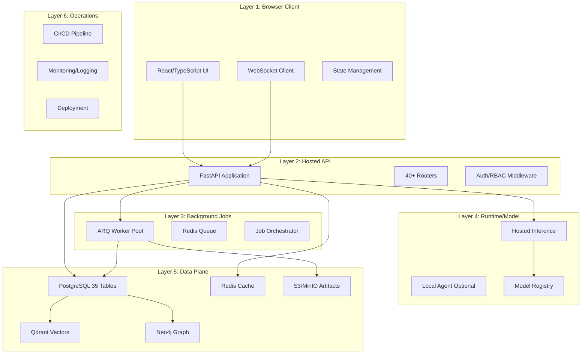
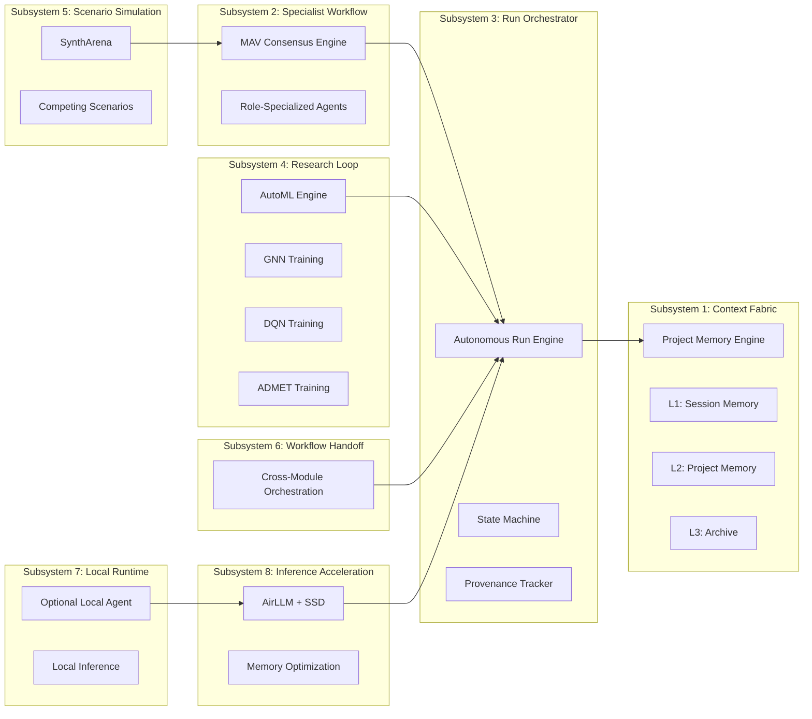
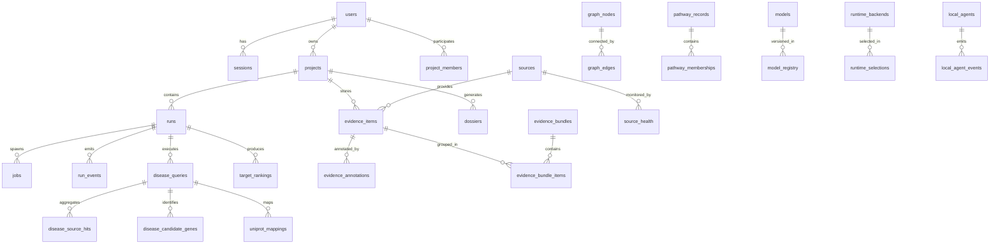
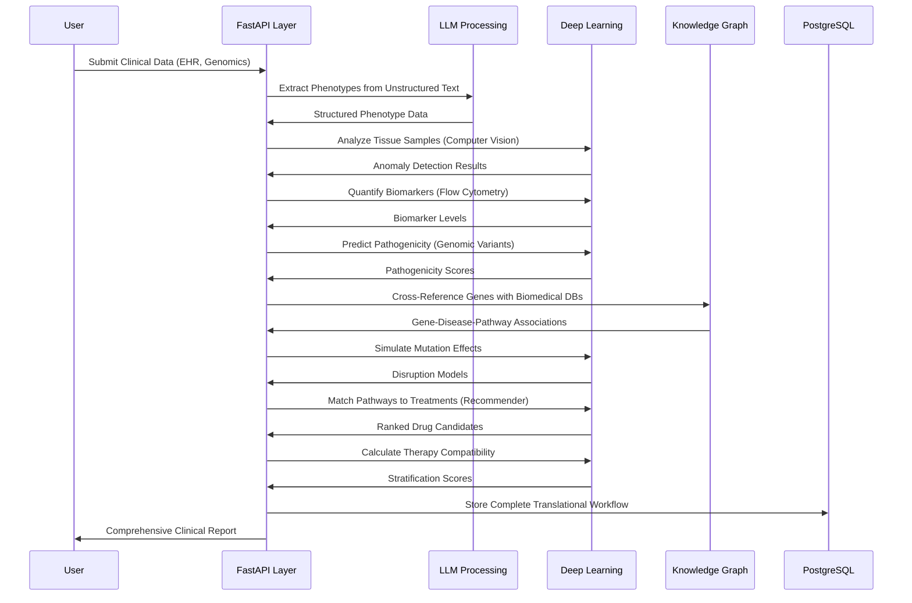
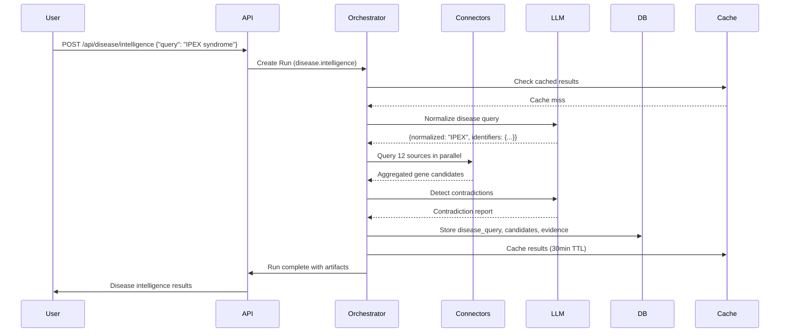
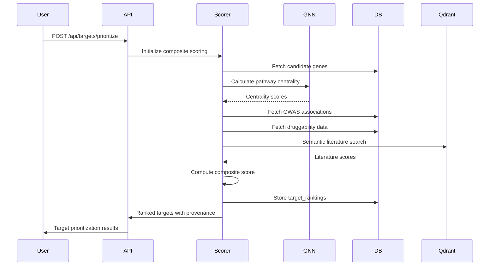

# Design Document: Drug Designer Codebase Alignment

## Overview

This design document provides a comprehensive technical specification for aligning the Drug Designer codebase with the Drug_Designer.md requirements document (11,297 lines). The system is a browser-native, evidence-first, provenance-first scientific research platform implementing a six-layer architecture with 8 internal subsystems, 140+ external API connectors, and complete translational research workflows.

**Current State:** The codebase has substantial infrastructure (40+ routers, 40+ connectors, 35+ database tables, 8 subsystem directories) but requires systematic alignment with the formal specification to ensure completeness, consistency, and production readiness.

**Design Approach:** This document combines high-level architecture diagrams with low-level implementation specifications, formal algorithms, and gap analysis to provide a complete blueprint for achieving specification compliance.

## Architecture

### Six-Layer System Architecture



### Eight Internal Subsystems Integration Map



### Database Schema Architecture (35+ Tables)



### Clinical Workflow Integration Architecture



## High-Level Design

### Component Architecture

#### Frontend Components (React/TypeScript)

**Core Shell Components:**
- `AppShell` - Main application container with navigation
- `Sidebar` - Module navigation with health indicators
- `TopBar` - Project selector, runtime status, user menu
- `Inspector` - Right-side panel for provenance/diagnostics

**Page Components (60+ pages):**
- Disease Intelligence: `DiseaseIntelligence.tsx`, `DiseaseWorkbench.tsx`
- Target Discovery: `TargetPrioritization.tsx`, `GeneProteinExplorer.tsx`
- Evidence: `EvidencePage.tsx`, `EvidenceSearchPage.tsx`, `SavedEvidence.tsx`, `Contradictions.tsx`
- Graph/Pathways: `KGPage.tsx`, `PathwaysPage.tsx`, `InteractionMaps.tsx`, `MechanismMaps.tsx`, `PPINetworkPage.tsx`
- Structure/Design: `StructurePage.tsx`, `DesignPage.tsx`, `MoleculeCandidateReview.tsx`
- Translational: `TranslationalResearch.tsx`, `TranslationPage.tsx`, `PICOVerification.tsx`
- Labs: `TargetDiscoveryLabPage.tsx`, `MoleculeGenerationLabPage.tsx`, `PharmacogenomicsLabPage.tsx`, `VaccineLabPage.tsx`, `MetabolicEngineeringLabPage.tsx`, `PocketLabPage.tsx`
- Reports/Dossiers: `DossiersPage.tsx`, `ReportPage.tsx`, `ExportCenterPage.tsx`
- Runtime: `RuntimeCenter.tsx`, `ModelsPage.tsx`, `LocalAgentPage.tsx`, `HardwareStatus.tsx`, `RepairScreen.tsx`
- Project Management: `ProjectsPage.tsx`, `ProjectDetailPage.tsx`, `WorkspacePage.tsx`
- Memory: `MemoryPage.tsx`, `ContextBundles.tsx`, `HistoricalQueries.tsx`
- Operations: `RunsPage.tsx`, `RunDetailPage.tsx`, `JobCockpit.tsx`, `LogsPage.tsx`, `OperationsPage.tsx`
- Advanced: `SynthArenaPage.tsx`, `ScenarioArenaPage.tsx`, `LabsPage.tsx`

**State Management:**
- `AuthProvider` - JWT authentication state
- `InspectorContext` - Provenance panel state
- `PageConfidenceContext` - Module health/confidence tracking
- `ToastContext` - Global notifications
- `websocket.ts` - Real-time run progress updates

#### Backend Services (FastAPI)

**Router Organization (40+ routers):**

| Router | Endpoints | Purpose |
|--------|-----------|---------|
| `auth.py` | `/api/auth/login`, `/api/auth/register`, `/api/auth/refresh` | JWT authentication |
| `projects.py` | `/api/projects/*` | Project CRUD, membership |
| `disease.py` | `/api/disease/*` | Disease intelligence pipeline |
| `targets.py` | `/api/targets/*` | Target prioritization |
| `evidence.py` | `/api/evidence/*` | Evidence search/retrieval |
| `graph.py` | `/api/graph/*` | Knowledge graph queries |
| `pathways.py` | `/api/pathways/*` | Pathway enrichment |
| `structure.py` | `/api/structure/*` | Protein structure viewer |
| `molecules.py` | `/api/molecules/*` | Molecule generation |
| `design.py` | `/api/design/*` | ADMET/retrosynthesis |
| `translational.py` | `/api/translational/*` | Clinical evidence |
| `translation.py` | `/api/translation/*` | Translational workflows |
| `dossier.py` | `/api/dossiers/*` | Decision dossier generation |
| `reports.py` | `/api/reports/*` | Report generation |
| `runs.py` | `/api/runs/*` | Run tracking/history |
| `runtimes.py` | `/api/runtimes/*` | Runtime selection |
| `models.py` | `/api/models/*` | Model catalog |
| `labs.py` | `/api/labs/*` | Research labs |
| `syntharena.py` | `/api/syntharena/*` | Scenario simulation |
| `exports.py` | `/api/exports/*` | Export generation |
| `sources.py` | `/api/sources/*` | Source health monitoring |
| `mapping.py` | `/api/mapping/*` | UniProt mapping |
| `logs.py` | `/api/logs/*` | Structured logs |
| `media.py` | `/api/media/*` | Media artifacts |
| `hardware.py` | `/api/hardware/*` | Hardware diagnostics |
| `websocket_routes.py` | `/ws/runs/{run_id}` | Real-time updates |

**Core Services:**

```
apps/api/core/
├── auth.py              # JWT token generation/validation
├── db.py                # SQLAlchemy async session management
├── cache.py             # Redis caching layer
├── circuit_breaker.py   # Connector failure protection
├── rate_limiter.py      # API rate limiting
├── event_bus.py         # Internal event system
├── http_client.py       # Shared HTTP client with rate limiting
├── inference_engine.py  # LLM/model inference routing
├── vector_store.py      # Qdrant vector operations
├── qdrant_utils.py      # Vector search utilities
├── provenance.py        # Provenance tracking
├── audit.py             # Audit logging
├── rbac.py              # Role-based access control
├── llm_security.py      # Prompt injection defense
├── websocket_manager.py # WebSocket connection management
└── viking_pipeline.py   # Context fabric retrieval
```

**Connector Architecture (40+ connectors):**

```
apps/api/connectors/
├── base.py              # BaseConnector abstract class
├── heterogeneous.py     # Multi-source orchestrator
├── Literature:
│   ├── pubmed.py
│   ├── europe_pmc.py
│   ├── biorxiv.py
│   ├── semantic_scholar.py
│   ├── openalex.py
│   └── crossref.py
├── Disease/Ontology:
│   ├── disease_ontology.py
│   ├── hpo.py
│   ├── orphanet.py
│   └── omim.py
├── Targets/Proteins:
│   ├── uniprot.py
│   ├── ensembl.py
│   ├── alphafold.py
│   ├── rcsb.py
│   ├── interpro.py
│   └── pharos.py
├── Pathways/Interactions:
│   ├── reactome.py
│   ├── kegg.py
│   ├── wikipathways.py
│   ├── string_db.py
│   ├── intact.py
│   └── biogrid.py
├── Compounds/Drugs:
│   ├── chembl.py
│   ├── pubchem.py
│   ├── drugbank.py
│   ├── drugcentral.py
│   └── chebi.py
├── Genetics/Variants:
│   ├── gnomad.py
│   ├── dbsnp.py
│   ├── clinvar.py
│   ├── gwas_catalog.py
│   ├── disgenet.py
│   └── opentargets.py
├── Translational/Clinical:
│   ├── clinicaltrials.py
│   └── patents.py
└── Population Context:
    ├── genomeasia_loader.py
    ├── indigen_loader.py
    └── igvdb_loader.py
```

### Data Flow Architecture

#### Disease Intelligence Pipeline



#### Target Prioritization Flow



### Deployment Architecture

```mermaid
graph TB
    subgraph "Docker Compose Stack"
        subgraph "Application Layer"
            API1[API Server 1]
            API2[API Server 2]
            Worker1[ARQ Worker 1]
            Worker2[ARQ Worker 2]
            Worker3[ARQ Worker 3]
            Web[Nginx + React SPA]
        end
        
        subgraph "Data Layer"
            PG[(PostgreSQL 16)]
            Redis[(Redis 7)]
            Qdrant[(Qdrant v1.9)]
            Neo4j[(Neo4j 5)]
            MinIO[(MinIO S3)]
        end
        
        subgraph "Observability"
            Prometheus[Prometheus]
            Grafana[Grafana]
            Loki[Loki]
        end
        
        subgraph "Gateway"
            NginxLB[Nginx Load Balancer]
        end
    end
    
    Users --> NginxLB
    NginxLB --> API1
    NginxLB --> API2
    NginxLB --> Web
    API1 --> PG
    API2 --> PG
    API1 --> Redis
    API2 --> Redis
    API1 --> Qdrant
    API2 --> Qdrant
    API1 --> Neo4j
    API2 --> Neo4j
    Worker1 --> Redis
    Worker2 --> Redis
    Worker3 --> Redis
    Worker1 --> PG
    Worker2 --> PG
    Worker3 --> PG
    API1 --> MinIO
    API2 --> MinIO
    Worker1 --> MinIO
    Prometheus --> API1
    Prometheus --> API2
    Grafana --> Prometheus
    Grafana --> Loki

## Low-Level Design

### Database Schema Specifications


## Low-Level Design

### Database Schema Specifications


## Low-Level Design

### Database Schema Specifications

#### Core Tables (Wave 1)

**users table:**
```sql
CREATE TABLE users (
    id UUID PRIMARY KEY DEFAULT gen_random_uuid(),
    email VARCHAR(255) UNIQUE NOT NULL,
    password_hash VARCHAR(255) NOT NULL,
    display_name VARCHAR(100),
    role VARCHAR(20) DEFAULT 'collaborator',
    created_at TIMESTAMPTZ DEFAULT NOW(),
    last_login TIMESTAMPTZ
);
CREATE INDEX idx_users_email ON users(email);
```

**sessions table:**
```sql
CREATE TABLE sessions (
    id TEXT PRIMARY KEY,
    user_id TEXT NOT NULL REFERENCES users(id),
    token_hash TEXT NOT NULL UNIQUE,
    ip_hash TEXT,
    user_agent_hash TEXT,
    client_type TEXT DEFAULT 'browser',
    created_at TIMESTAMPTZ NOT NULL DEFAULT NOW(),
    last_seen_at TIMESTAMPTZ,
    expires_at TIMESTAMPTZ NOT NULL,
    is_active BOOLEAN DEFAULT TRUE
);
CREATE INDEX idx_sessions_user_id ON sessions(user_id);
```
