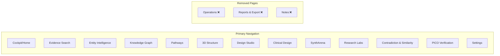
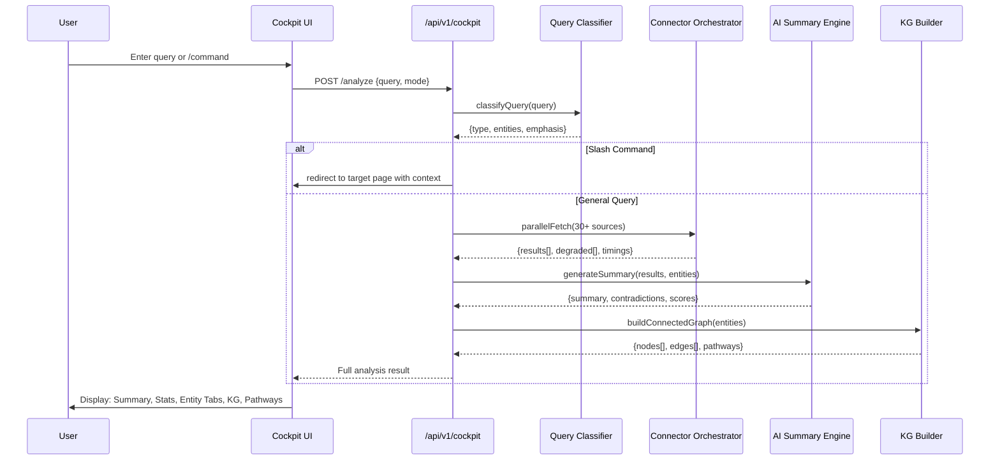

# Design Document: Drug Designer Product Alignment & Full Working Implementation

## Overview

Drug Designer is a browser-native scientific research platform for drug discovery that currently exists as a large codebase (~60 frontend pages, ~43 API routers, ~158 connectors) but fails to function as a cohesive product. Despite the existing spec claiming 97% completion, the majority of features are scaffolds, placeholders, or disconnected components that don't deliver real scientific value.

This design document defines the complete technical overhaul required to make every feature actually functional, aligned with the Drug_Designer.md master specification (11,350 lines). The redesign covers 14 major subsystems: Cockpit (agentic search hub), Disease Intelligence + Target Prioritization (merged), Knowledge Graphs (connected, colored, clickable), Pathways (redesigned with source attribution), PPI/Gene/Protein merge, 3D Structure Tab (ESM/AlphaFold/RCSB), Design Studio (all plugins working), Clinical Design (10-step workflow), SynthArena (fully populated), Research Labs (radical redesign), Contradiction & Similarity, PICO, page removals, and Settings elaboration.

The tech stack remains: React/TypeScript/Vite (frontend), FastAPI/Python (backend), PostgreSQL + Qdrant + Redis (data layer). The architecture follows the six-layer model defined in Drug_Designer.md: Browser Client → Hosted API → Background Jobs → Runtime/Model → Data Plane → Operations.

## Architecture

### System-Level Architecture

```mermaid
graph TD
    subgraph "Layer 1: Browser Client"
        COCKPIT[Cockpit / Search Hub]
        DI[Disease Intelligence + Target Prioritization]
        KG[Knowledge Graph + PPI]
        PW[Pathways Explorer]
        STRUCT[3D Structure Tab]
        DESIGN[Design Studio]
        CLINICAL[Clinical Design 10-Step]
        SYNTH[SynthArena]
        LABS[Research Labs]
        CONTRA[Contradiction & Similarity]
        PICO[PICO Verification]
        SETTINGS[Settings]
    end

    subgraph "Layer 2: FastAPI Backend"
        COCKPIT_API[/api/v1/cockpit/*]
        ENTITY_API[/api/v1/entity-intelligence/*]
        GRAPH_API[/api/v1/graph/*]
        PATHWAY_API[/api/v1/pathways/*]
        STRUCTURE_API[/api/v1/structure/*]
        DESIGN_API[/api/v1/design/*]
        CLINICAL_API[/api/v1/clinical/*]
        SYNTH_API[/api/v1/syntharena/*]
        LABS_API[/api/v1/labs/*]
        CONTRA_API[/api/v1/contradictions/*]
        PICO_API[/api/v1/pico/*]
    end

    subgraph "Layer 3: Background Jobs (Redis/ARQ)"
        Q1[retrieval.fast]
        Q2[retrieval.deep]
        Q3[disease.intelligence]
        Q4[target.ranking]
        Q5[graph.pathway]
        Q6[chemistry.design]
        Q7[pico.population]
    end

    subgraph "Layer 4: Runtime / Model"
        HOSTED[Hosted Inference]
        LOCAL[Local Runtime Agent]
        ESM[ESM Models API]
        ALPHAFOLD[AlphaFold DB]
    end

    subgraph "Layer 5: Data Plane"
        PG[(PostgreSQL)]
        QD[(Qdrant Vectors)]
        REDIS[(Redis Cache)]
        S3[(S3/MinIO Artifacts)]
    end

    COCKPIT --> COCKPIT_API
    DI --> ENTITY_API
    KG --> GRAPH_API
    PW --> PATHWAY_API
    STRUCT --> STRUCTURE_API
    DESIGN --> DESIGN_API
    CLINICAL --> CLINICAL_API
    SYNTH --> SYNTH_API
    LABS --> LABS_API
    CONTRA --> CONTRA_API
    PICO --> PICO_API

    COCKPIT_API --> Q1 & Q2
    ENTITY_API --> Q3 & Q4
    GRAPH_API --> Q5
    DESIGN_API --> Q6
    PICO_API --> Q7

    Q3 --> HOSTED
    Q4 --> HOSTED
    Q6 --> HOSTED & LOCAL
    STRUCTURE_API --> ESM & ALPHAFOLD

    COCKPIT_API --> PG & QD & REDIS
    ENTITY_API --> PG & QD
    GRAPH_API --> PG & QD
    DESIGN_API --> PG & S3
    CLINICAL_API --> PG
```

### Navigation Architecture (Post-Redesign)



### Cockpit Agentic Search Flow




## Components and Interfaces

### Component 1: Cockpit (Agentic Search Hub)

**Purpose**: Single search bar that acts as an agentic extension of every page. Supports general queries (Evidence Search) and backslash commands that route to specific pages with pre-loaded context.

**Current State**: WorkspacePage.tsx exists with a search bar and 18-section report rendering, but lacks proper entity detail pages, entity comparison, similarity finding, connected KG with colored nodes, and combined pathway display.

**Interface**:
```typescript
// Cockpit Query Classification
interface CockpitQuery {
  raw: string;
  mode: 'general' | 'slash_command';
  command?: SlashCommand;
  entities: EntityReference[];
  emphasis: string[];
}

interface SlashCommand {
  command: string;  // e.g. "/disease", "/structure", "/kg"
  args: string;
  targetRoute: string;
  action: HandoffAction;
}

// Cockpit Analysis Result (enhanced)
interface CockpitAnalysisResult {
  query: string;
  run_id: string;
  trace_id: string;
  query_classification: QueryClassification;
  summary: string;
  stats: AnalysisStats;
  categories: EntityCategory[];  // Proteins, Genes, Publications, etc.
  graph: ConnectedKnowledgeGraph;  // NEW: colored nodes, clickable edges
  unified_pathways: UnifiedPathwayMap;  // NEW: combined pathway
  contradictions: Contradiction[];
  similarities: Similarity[];  // NEW
  entity_details: Map<string, EntityDetailPage>;  // NEW: per-entity detail
  literature_table: Publication[];
  clinical_trials: ClinicalTrial[];
  provenance: ProvenanceChain;
}

// Connected Knowledge Graph with colored nodes
interface ConnectedKnowledgeGraph {
  nodes: KGNode[];
  edges: KGEdge[];
  layout: 'force' | 'hierarchical' | 'circular';
}

interface KGNode {
  id: string;
  label: string;
  type: EntityType;  // determines color
  color: string;     // derived from type
  size: number;      // based on centrality
  metadata: Record<string, unknown>;
}

interface KGEdge {
  source: string;
  target: string;
  type: string;
  weight: number;
  reason: string;       // clickable: shows WHY connected
  evidence_ids: string[];
  provenance: EdgeProvenance;
}

// Entity Detail Page (accessible from entity tabs)
interface EntityDetailPage {
  entity: EntityReference;
  ai_overview: string;
  publications: Publication[];
  patents: Patent[];
  citations: Citation[];
  clinical_trials: ClinicalTrial[];
  related_entities: EntityReference[];
  actions: EntityAction[];  // "Run in Design Studio", "View Structure", etc.
}
```

**Responsibilities**:
- Classify incoming queries (general vs slash command)
- Route slash commands to target pages with full context handoff
- Orchestrate parallel fetch across 30+ data sources
- Build connected knowledge graph with entity-type coloring
- Generate AI summary with traceable evidence
- Provide entity detail pages with AI overview
- Support entity comparison and similarity finding
- Display combined pathway connecting all query terms

### Component 2: Disease Intelligence + Target Prioritization (Merged)

**Purpose**: Unified entity intelligence workbench with 5 input boxes supporting backslash commands (/Drug, /Disease, /Molecule, /Gene, /Protein, /Blank). Finds central database IDs, matches with diseases/drugs, provides Cytoscape-like analysis tools, PPI networks, KGs, and pathways.

**Current State**: EntityIntelligence.tsx exists but Disease Intelligence and Target Prioritization are separate pages. The merge needs to unify them with backslash-command input boxes and Cytoscape-like graph analysis.

**Interface**:
```typescript
// Merged Entity Intelligence Input
interface EntityIntelligenceInput {
  slots: InputSlot[];  // 5 input boxes
  analysis_mode: 'discovery' | 'comparison' | 'network' | 'pathway';
}

interface InputSlot {
  index: number;  // 0-4
  command: '/Drug' | '/Disease' | '/Molecule' | '/Gene' | '/Protein' | '/Blank';
  value: string;
  resolved_entity?: ResolvedEntity;
}

interface ResolvedEntity {
  canonical_id: string;  // MONDO, UniProt, ChEMBL, etc.
  source_db: string;
  name: string;
  type: EntityType;
  aliases: string[];
  cross_references: CrossReference[];
}

// Cytoscape-like Analysis Tools
interface GraphAnalysisTools {
  centrality: CentralityResult;
  community_detection: CommunityResult;
  shortest_path: PathResult;
  subgraph_extraction: SubgraphResult;
  ppi_network: PPINetworkResult;
  pathway_enrichment: PathwayEnrichmentResult;
}

// Target Prioritization (integrated)
interface TargetRankingResult {
  targets: RankedTarget[];
  scoring_profile: ScoringProfile;
  contradiction_flags: ContradictionFlag[];
}

interface RankedTarget {
  symbol: string;
  uniprot_id: string;
  rank: number;
  composite_score: number;
  score_breakdown: {
    gwas: number;
    pathway: number;
    druggability: number;
    safety: number;
    literature: number;
  };
  explanation: string;
  evidence_count: number;
  contradiction_flag: boolean;
}
```

**Responsibilities**:
- Resolve entity identifiers across databases (MONDO, UniProt, ChEMBL, Ensembl)
- Merge disease intelligence and target prioritization into single workflow
- Provide Cytoscape-like graph analysis (centrality, community detection, shortest path)
- Display PPI networks as a mode within the graph view
- Score and rank targets with explainable breakdowns
- Support backslash commands in each of the 5 input slots

### Component 3: Knowledge Graphs (Connected, Colored, Clickable)

**Purpose**: Interactive knowledge graph with colored nodes by entity type, clickable edges showing connection reasons, and PPI Network merged as a mode.

**Current State**: KGPage.tsx exists with basic graph rendering via ForceGraph component. Needs colored nodes, clickable edges with reason display, and PPI mode integration.

**Interface**:
```typescript
// KG Display Configuration
interface KGConfig {
  mode: 'knowledge_graph' | 'ppi_network';  // PPI merged as mode
  entity_id?: string;
  depth: number;
  edge_types: string[];
  color_scheme: EntityColorScheme;
  layout: 'force' | 'hierarchical' | 'circular' | 'dagre';
}

// Entity Color Scheme
const ENTITY_COLORS: Record<EntityType, string> = {
  protein: '#7c3aed',    // purple
  gene: '#6366f1',       // indigo
  disease: '#dc2626',    // red
  drug: '#e11d48',       // rose
  compound: '#d97706',   // amber
  pathway: '#0891b2',    // cyan
  publication: '#3b82f6', // blue
  clinical_trial: '#059669', // emerald
  variant: '#ea580c',    // orange
};

// Edge Click Handler
interface EdgeClickEvent {
  edge: KGEdge;
  reason: string;
  evidence: EvidenceItem[];
  source_provenance: ProvenanceEntry[];
}

// PPI Network Mode
interface PPINetworkConfig extends KGConfig {
  mode: 'ppi_network';
  confidence_threshold: number;  // STRING confidence
  interaction_types: ('physical' | 'genetic' | 'coexpression' | 'predicted')[];
  species: string;
}
```

### Component 4: Pathways (Redesigned with Source Attribution)

**Purpose**: Properly displayed pathway visualization with source attribution and clickable explanations at every point. Not just API fetch — full interactive rendering.

**Current State**: PathwaysPage.tsx fetches pathway data but doesn't properly render interactive pathway diagrams with source attribution.

**Interface**:
```typescript
// Pathway Display
interface PathwayView {
  pathway_id: string;
  name: string;
  source: 'KEGG' | 'Reactome' | 'WikiPathways' | 'SIGNOR' | 'NetPath';
  source_url: string;
  nodes: PathwayNode[];
  edges: PathwayEdge[];
  disease_context?: DiseasePathwayContext;
  annotations: PathwayAnnotation[];
}

interface PathwayNode {
  id: string;
  label: string;
  type: 'gene' | 'protein' | 'compound' | 'reaction' | 'complex';
  position: { x: number; y: number };
  clickable: true;
  explanation: string;  // shown on click
  evidence: EvidenceItem[];
  source_attribution: string;
}

interface PathwayEdge {
  source: string;
  target: string;
  type: 'activation' | 'inhibition' | 'phosphorylation' | 'binding' | 'catalysis';
  clickable: true;
  explanation: string;
  evidence: EvidenceItem[];
  source_attribution: string;
}

interface DiseasePathwayContext {
  disease_id: string;
  affected_nodes: string[];
  dysregulated_edges: string[];
  therapeutic_targets: string[];
}
```

### Component 5: 3D Structure Tab

**Purpose**: Full 3D molecular structure viewer matching the demo videos (1.mp4, 2.mp4). Uses ESM Models API, AlphaFold, and RCSB PDB. Shows Summary, 3D Structure, Binding Sites, Annotations, Sequence, Genome, Comparison. Option to import to Design Studio.

**Interface**:
```typescript
// Structure Tab Configuration
interface StructureView {
  target_id: string;  // PDB ID or UniProt ID
  active_tab: 'summary' | '3d_structure' | 'binding_sites' | 'annotations' | 'sequence' | 'genome' | 'comparison';
  viewer_config: MolstarConfig;
}

interface MolstarConfig {
  representation: 'cartoon' | 'ball-and-stick' | 'surface' | 'ribbon';
  color_scheme: 'chain' | 'residue' | 'bfactor' | 'hydrophobicity' | 'secondary_structure';
  show_ligands: boolean;
  show_water: boolean;
  highlight_binding_sites: boolean;
  selected_chains: string[];
}

// Structure Data Sources
interface StructureData {
  pdb_entry?: PDBEntry;           // from RCSB PDB
  alphafold_model?: AlphaFoldModel; // from AlphaFold DB
  esm_prediction?: ESMPrediction;   // from ESM Models API
  binding_sites: BindingSite[];
  annotations: StructureAnnotation[];
  sequence: ProteinSequence;
  genome_context: GenomeContext;
}

interface ESMPrediction {
  model: 'esm2' | 'esmfold' | 'esm3';
  api_key: string;  // 5aO6h6KTeS4iRtRBgMyf4d
  confidence_scores: number[];  // per-residue pLDDT
  structure_pdb: string;  // PDB format string
}

interface BindingSite {
  id: string;
  residues: string[];
  center: [number, number, number];
  volume: number;
  druggability_score: number;
  source: 'fpocket' | 'p2rank' | 'ligand_based';
  ligands?: string[];
}

// Import to Design Studio action
interface ImportToDesignStudio {
  target_id: string;
  binding_site: BindingSite;
  structure_source: 'pdb' | 'alphafold' | 'esm';
  handoff_payload: SharedHandoffPayload;
}
```

### Component 6: Design Studio (All Plugins Working)

**Purpose**: Fully functional molecule design studio with all plugins operational: RDKit (molecular operations), AutoDock Vina (docking), fpocket (pocket detection), GPU Acceleration, Diffusion Model (de novo generation). Option to move designed entity to Research Lab.

**Current State**: DesignPage.tsx has a 7-step workflow UI with plugin status panel, but plugins report "not detected" and don't actually execute real computations.

**Interface**:
```typescript
// Design Studio Plugin System
interface DesignPlugin {
  name: string;
  status: 'available' | 'not_detected' | 'cpu_only' | 'degraded';
  version?: string;
  capabilities: string[];
  health_check: () => Promise<PluginHealth>;
}

interface DesignStudioState {
  session_id: string;
  target_pdb: string;
  binding_site: BindingSite;
  ligands: Ligand[];
  analogs: Analog[];
  scores: MoleculeScore[];
  admet_results: ADMETResult[];
  docking_results: DockingResult[];
  novelty_results: NoveltyResult[];
  retrosynthesis: RetrosynthesisResult;
  diffusion_candidates: DiffusionCandidate[];
}

// Plugin Execution Interfaces
interface RDKitPlugin {
  computeDescriptors(smiles: string): Promise<PhysiochemProps>;
  generateAnalogs(smiles: string, method: string): Promise<Analog[]>;
  validateSmiles(smiles: string): Promise<boolean>;
  computeFingerprint(smiles: string): Promise<string>;
}

interface AutoDockVinaPlugin {
  dock(request: DockingRequest): Promise<DockingResult>;
  prepareLigand(smiles: string): Promise<string>;  // PDBQT
  prepareReceptor(pdb_id: string): Promise<string>;  // PDBQT
}

interface FpocketPlugin {
  detectPockets(pdb_id: string): Promise<BindingSite[]>;
  rankPockets(sites: BindingSite[]): Promise<BindingSite[]>;
}

interface DiffusionModelPlugin {
  generate(config: DiffusionConfig): Promise<DiffusionCandidate[]>;
  conditionOnPocket(pocket: BindingSite): Promise<DiffusionCandidate[]>;
}

// Send to Research Lab
interface SendToLabPayload {
  lab_type: 'target-discovery' | 'molecule-generation' | 'admet' | 'retrosynthesis' | 'pocket' | 'vaccine' | 'metabolic-engineering' | 'pharmacogenomics';
  smiles: string;
  target_pdb: string;
  binding_site?: BindingSite;
  scores?: MoleculeScore;
  admet?: ADMETResult;
  session_id: string;
}
```

### Component 7: Clinical Design (10-Step Workflow)

**Purpose**: Redesigned clinical workflow following the 10-step process defined in Drug_Designer.md. Currently TranslationalResearch.tsx exists but doesn't follow the structured workflow.

**Interface**:
```typescript
// 10-Step Clinical Workflow
interface ClinicalWorkflow {
  id: string;
  project_id: string;
  current_step: number;  // 1-10
  steps: ClinicalStep[];
  status: 'in_progress' | 'completed' | 'blocked';
}

interface ClinicalStep {
  number: number;
  name: string;
  status: 'not_started' | 'in_progress' | 'completed' | 'skipped';
  inputs: StepInput[];
  outputs: StepOutput[];
  evidence: EvidenceItem[];
  notes: string;
}

const CLINICAL_STEPS: ClinicalStep[] = [
  { number: 1, name: 'Disease Context & Unmet Need', /* ... */ },
  { number: 2, name: 'Target Validation Evidence', /* ... */ },
  { number: 3, name: 'Biomarker Strategy', /* ... */ },
  { number: 4, name: 'Patient Population Definition', /* ... */ },
  { number: 5, name: 'Endpoint Selection', /* ... */ },
  { number: 6, name: 'Comparator & Control Strategy', /* ... */ },
  { number: 7, name: 'Safety Signal Assessment', /* ... */ },
  { number: 8, name: 'Regulatory Pathway Analysis', /* ... */ },
  { number: 9, name: 'Trial Design Parameters', /* ... */ },
  { number: 10, name: 'Go/No-Go Decision Framework', /* ... */ },
];
```

### Component 8: SynthArena (Fully Populated)

**Purpose**: Complete drug candidate comparison arena with scenario simulation, evidence-backed scoring, debate simulation, and dossier generation. Currently has session management but no real analysis.

**Interface**:
```typescript
// SynthArena Full Implementation
interface SynthArenaSession {
  id: string;
  name: string;
  target: string;
  description: string;
  compounds: ArenaCompound[];
  scenarios: ArenaScenario[];
  scoring_matrix: ScoringMatrix;
  debate_history: DebateEntry[];
  dossier_consensus: string;
  winner: string | null;
  provenance: ProvenanceChain;
}

interface ArenaCompound {
  name: string;
  smiles: string;
  source: string;
  evidence_note: string;
  properties: Record<string, unknown>;
}

interface ScoringMatrix {
  criteria: string[];
  scores: Record<string, Record<string, number>>;  // compound -> criterion -> score
  weights: Record<string, number>;  // criterion -> weight
  overall: Record<string, number>;  // compound -> weighted score
}

interface ArenaScenario {
  id: string;
  name: string;
  description: string;
  seed_entities: Record<string, string[]>;
  weights: Record<string, number>;
  simulation_result?: ScenarioResult;
}

interface ScenarioResult {
  trajectory: TrajectoryPoint[];
  final_score: number;
  risk_factors: string[];
  contradictions: Contradiction[];
  evidence_support: number;
}
```

### Component 9: Research Labs (Radical Redesign)

**Purpose**: All 8 research labs must be fully functional with real computation, not empty shells.

**Interface**:
```typescript
// Research Lab Base Interface
interface ResearchLab {
  id: string;
  name: string;
  type: LabType;
  status: 'ready' | 'running' | 'completed' | 'error';
  run_config: LabRunConfig;
  results: LabResult;
  provenance: ProvenanceChain;
}

type LabType = 
  | 'target-discovery'
  | 'pocket'
  | 'molecule-generation'
  | 'admet'
  | 'retrosynthesis'
  | 'vaccine'
  | 'metabolic-engineering'
  | 'pharmacogenomics';

// Each lab has specific input/output contracts
interface TargetDiscoveryLab extends ResearchLab {
  type: 'target-discovery';
  input: { disease_id: string; gene_list?: string[]; pathway_context?: string };
  output: { ranked_targets: RankedTarget[]; network: PPINetworkResult; pathways: PathwayView[] };
}

interface PocketLab extends ResearchLab {
  type: 'pocket';
  input: { pdb_id: string; chain?: string };
  output: { pockets: BindingSite[]; druggability_scores: number[]; visualization: string };
}

interface MoleculeGenerationLab extends ResearchLab {
  type: 'molecule-generation';
  input: { target_pdb: string; binding_site: BindingSite; seed_smiles?: string; method: 'rl' | 'diffusion' | 'enumeration' };
  output: { candidates: GeneratedMolecule[]; optimization_history: OptimizationStep[] };
}

interface ADMETLab extends ResearchLab {
  type: 'admet';
  input: { smiles_list: string[] };
  output: { predictions: ADMETResult[]; confidence_intervals: ConformalInterval[] };
}

interface RetrosynthesisLab extends ResearchLab {
  type: 'retrosynthesis';
  input: { target_smiles: string; max_steps?: number };
  output: { routes: SynthesisRoute[]; feasibility_scores: number[] };
}

interface VaccineLab extends ResearchLab {
  type: 'vaccine';
  input: { antigen_sequence: string; target_pathogen: string };
  output: { epitopes: Epitope[]; candidates: VaccineCandidate[] };
}

interface MetabolicEngineeringLab extends ResearchLab {
  type: 'metabolic-engineering';
  input: { organism: string; target_metabolite: string; pathway_modifications: string[] };
  output: { flux_analysis: FluxResult; optimized_pathways: PathwayModification[] };
}

interface PharmacogenomicsLab extends ResearchLab {
  type: 'pharmacogenomics';
  input: { drug_id: string; population?: string; gene_variants?: string[] };
  output: { pharmacogene_interactions: PGxInteraction[]; dosing_recommendations: DosingRec[] };
}
```


### Component 10: Contradiction & Similarity Tab

**Purpose**: Find both contradictions AND similarities across evidence sources with working input and radical redesign. Currently Contradictions.tsx has UI but limited real functionality.

**Interface**:
```typescript
// Contradiction & Similarity Engine
interface ContradictionSimilarityResult {
  query: string;
  contradictions: ContradictionPair[];
  similarities: SimilarityCluster[];
  evidence_landscape: EvidenceLandscape;
}

interface ContradictionPair {
  id: string;
  claim_a: EvidenceClaim;
  claim_b: EvidenceClaim;
  type: 'directional' | 'temporal' | 'magnitude' | 'causal';
  severity: 'high' | 'medium' | 'low';
  explanation: string;
  resolution_suggestion?: string;
  provenance: { source_a: string; source_b: string };
}

interface SimilarityCluster {
  id: string;
  claims: EvidenceClaim[];
  similarity_score: number;
  shared_entities: EntityReference[];
  consensus_strength: 'strong' | 'moderate' | 'weak';
  explanation: string;
}

interface EvidenceClaim {
  text: string;
  source: string;
  publication_date: string;
  confidence: number;
  entities: EntityReference[];
  evidence_id: string;
}
```

### Component 11: PICO Verification

**Purpose**: Working PICO (Population, Intervention, Comparison, Outcome) extraction with radical redesign. Currently PICOVerification.tsx has UI but limited real functionality.

**Interface**:
```typescript
// PICO Extraction
interface PICOResult {
  query: string;
  extractions: PICOExtraction[];
  summary: string;
  evidence_quality: EvidenceQualityAssessment;
}

interface PICOExtraction {
  source: string;
  publication_id: string;
  population: PICOElement;
  intervention: PICOElement;
  comparison: PICOElement;
  outcome: PICOElement;
  study_design: string;
  sample_size?: number;
  confidence: number;
}

interface PICOElement {
  text: string;
  entities: EntityReference[];
  qualifiers: string[];
  confidence: number;
}
```

### Component 12: Settings (Elaborated)

**Purpose**: Comprehensive settings page covering all platform configuration.

**Interface**:
```typescript
interface SettingsConfig {
  sections: SettingsSection[];
}

type SettingsSection =
  | 'general'           // Theme, language, display preferences
  | 'sources'           // Connector configuration, API keys, health
  | 'runtime'           // Hosted/Local mode, model selection
  | 'security'          // Auth, RBAC, session management
  | 'storage'           // Database, vector store, artifact storage
  | 'notifications'     // Alert preferences, email, webhook
  | 'export'            // Default formats, templates
  | 'accessibility'     // A11Y preferences, font size, contrast
  | 'advanced'          // Debug mode, logging level, cache management
  | 'diagnostics';      // System health, performance metrics
```

## Data Models

### Core Entity Model

```typescript
type EntityType = 
  | 'protein' | 'gene' | 'disease' | 'drug' 
  | 'compound' | 'pathway' | 'publication' 
  | 'clinical_trial' | 'variant' | 'molecule';

interface EntityReference {
  entity_type: EntityType;
  entity_id: string;
  label: string;
  source_system: string;
  normalized: boolean;
  cross_references?: CrossReference[];
}

interface CrossReference {
  database: string;  // 'UniProt', 'ChEMBL', 'MONDO', 'Ensembl', etc.
  id: string;
  url?: string;
}
```

### Evidence Model

```typescript
interface EvidenceItem {
  evidence_id: string;
  source_family: 'literature' | 'disease' | 'target' | 'pathway' | 'compound' | 'genetics' | 'clinical' | 'population';
  source_name: string;
  external_record_id: string;
  title: string;
  snippet: string;
  url: string;
  published_at: string;
  retrieved_at: string;
  confidence: number;
  contradiction_group_id?: string;
  entities: EntityReference[];
  metadata: Record<string, unknown>;
}
```

### Provenance Model

```typescript
interface ProvenanceChain {
  sources_queried: number;
  sources_succeeded: number;
  sources_degraded: string[];
  contradictions_found: number;
  model_id?: string;
  runtime_mode: 'hosted' | 'local' | 'auto';
  run_id?: string;
  trace_id?: string;
  generated_at: string;
}
```

### Universal Response Envelope

```python
# Backend: Every API response wrapped in this envelope
class ResponseEnvelope(BaseModel):
    request_id: str
    trace_id: str
    status: Literal["ok", "partial", "degraded", "error"]
    data: Any
    warnings: list[str] = []
    errors: list[ErrorDetail] = []
    provenance: ProvenanceInfo
    runtime_context: RuntimeContext
    timing: TimingInfo

class ErrorDetail(BaseModel):
    code: str
    message: str
    details: dict = {}
    recoverable: bool = True
    suggested_action: str = ""

class ProvenanceInfo(BaseModel):
    sources: list[str]
    generated_at: str
    model_id: Optional[str] = None
    runtime_mode: str = "hosted"
    run_id: Optional[str] = None

class RuntimeContext(BaseModel):
    mode: str = "hosted"
    selected_runtime: str = ""
    selected_model: str = ""
    fallback_used: bool = False

class TimingInfo(BaseModel):
    started_at: str
    finished_at: str
    elapsed_ms: int
```

**Validation Rules**:
- Every response MUST include provenance with source lineage
- Every response MUST include timing information
- Error responses MUST use structured ErrorDetail, never raw tracebacks
- Degraded responses MUST list which sources failed and why

## Algorithmic Pseudocode

### Main Processing Algorithm: Cockpit Agentic Search

```python
async def cockpit_analyze(query: str, project_id: str) -> CockpitAnalysisResult:
    """
    Main cockpit analysis pipeline. Classifies query, orchestrates parallel
    source fetching, builds connected KG, generates AI summary.
    """
    # PRECONDITIONS:
    # - query is non-empty string
    # - project_id is valid UUID
    
    # Step 1: Classify query
    classification = classify_query(query)
    
    # Step 2: Handle slash commands
    if classification.mode == "slash_command":
        command = parse_slash_command(query)
        context = build_handoff_context(command, project_id)
        return redirect_to_target(command.target_route, context)
    
    # Step 3: Parallel source fetching (30+ connectors)
    connector_tasks = [
        connector.fetch(query) 
        for connector in get_active_connectors(classification.emphasis)
    ]
    raw_results = await asyncio.gather(*connector_tasks, return_exceptions=True)
    
    # Step 4: Separate successful vs degraded
    successful = [r for r in raw_results if not isinstance(r, Exception) and r.get("status") != "degraded"]
    degraded = [r for r in raw_results if isinstance(r, Exception) or r.get("status") == "degraded"]
    
    # Step 5: Entity extraction and normalization
    entities = extract_and_normalize_entities(successful)
    
    # Step 6: Build connected knowledge graph
    kg = build_connected_kg(entities, successful)
    # INVARIANT: Every node has a color based on entity type
    # INVARIANT: Every edge has a reason and evidence_ids
    
    # Step 7: Build unified pathway map
    pathways = build_unified_pathways(entities, successful)
    
    # Step 8: Detect contradictions and similarities
    contradictions = detect_contradictions(successful)
    similarities = detect_similarities(successful)
    
    # Step 9: Generate AI summary with traceable evidence
    summary = await generate_traceable_summary(query, successful, entities, contradictions)
    
    # Step 10: Build entity detail pages
    entity_details = build_entity_details(entities, successful)
    
    # POSTCONDITIONS:
    # - result.provenance contains full source lineage
    # - result.graph.nodes all have color field set
    # - result.graph.edges all have reason field set
    # - result.contradictions are evidence-backed
    # - result.entity_details has AI overview for each entity
    
    return CockpitAnalysisResult(
        query=query,
        summary=summary,
        categories=categorize_results(successful),
        graph=kg,
        unified_pathways=pathways,
        contradictions=contradictions,
        similarities=similarities,
        entity_details=entity_details,
        provenance=build_provenance(successful, degraded),
    )
```

### Entity Resolution Algorithm

```python
async def resolve_entity(raw_input: str, command: str) -> ResolvedEntity:
    """
    Resolves a raw entity string to canonical database IDs.
    Uses multi-source triangulation for confidence.
    
    PRECONDITIONS:
    - raw_input is non-empty
    - command is one of: /Drug, /Disease, /Molecule, /Gene, /Protein, /Blank
    
    POSTCONDITIONS:
    - Returns ResolvedEntity with canonical_id from authoritative source
    - cross_references contains IDs from at least 2 databases when available
    """
    resolvers = {
        '/Disease': [mondo_resolver, omim_resolver, mesh_resolver, efo_resolver],
        '/Gene': [ensembl_resolver, ncbi_gene_resolver, hgnc_resolver],
        '/Protein': [uniprot_resolver, pdb_resolver, alphafold_resolver],
        '/Drug': [chembl_resolver, drugbank_resolver, pubchem_resolver],
        '/Molecule': [pubchem_resolver, chembl_resolver, zinc_resolver],
        '/Blank': [universal_resolver],  # tries all
    }
    
    active_resolvers = resolvers.get(command, resolvers['/Blank'])
    results = await asyncio.gather(*[r.resolve(raw_input) for r in active_resolvers], return_exceptions=True)
    
    # Pick highest-confidence match
    valid = [r for r in results if not isinstance(r, Exception) and r.confidence > 0.5]
    if not valid:
        raise EntityResolutionError(f"Could not resolve '{raw_input}' via {command}")
    
    best = max(valid, key=lambda r: r.confidence)
    cross_refs = [CrossReference(database=r.source_db, id=r.canonical_id) for r in valid if r != best]
    
    return ResolvedEntity(
        canonical_id=best.canonical_id,
        source_db=best.source_db,
        name=best.name,
        type=command_to_entity_type(command),
        aliases=best.aliases,
        cross_references=cross_refs,
    )
```

### Knowledge Graph Construction Algorithm

```python
async def build_connected_kg(
    entities: list[EntityReference],
    evidence: list[dict],
) -> ConnectedKnowledgeGraph:
    """
    Builds a connected knowledge graph with colored nodes and annotated edges.
    
    PRECONDITIONS:
    - entities list is non-empty
    - evidence contains source-attributed data
    
    POSTCONDITIONS:
    - Every node has color derived from ENTITY_COLORS[node.type]
    - Every edge has non-empty reason field
    - Every edge has at least one evidence_id
    - Graph is connected (single component) when possible
    
    LOOP INVARIANT:
    - At each iteration, all added nodes have valid color assignments
    - At each iteration, all added edges have evidence backing
    """
    nodes: dict[str, KGNode] = {}
    edges: list[KGEdge] = []
    
    # Step 1: Create nodes from entities
    for entity in entities:
        node = KGNode(
            id=entity.entity_id,
            label=entity.label,
            type=entity.entity_type,
            color=ENTITY_COLORS[entity.entity_type],
            size=1.0,
            metadata={}
        )
        nodes[entity.entity_id] = node
    
    # Step 2: Extract relationships from evidence
    for item in evidence:
        relationships = extract_relationships(item)
        for rel in relationships:
            # Ensure both endpoints exist as nodes
            for endpoint in [rel.source_entity, rel.target_entity]:
                if endpoint.entity_id not in nodes:
                    nodes[endpoint.entity_id] = KGNode(
                        id=endpoint.entity_id,
                        label=endpoint.label,
                        type=endpoint.entity_type,
                        color=ENTITY_COLORS[endpoint.entity_type],
                        size=0.5,
                        metadata={}
                    )
            
            edges.append(KGEdge(
                source=rel.source_entity.entity_id,
                target=rel.target_entity.entity_id,
                type=rel.relationship_type,
                weight=rel.confidence,
                reason=rel.explanation,  # WHY these are connected
                evidence_ids=[item["evidence_id"]],
                provenance=EdgeProvenance(source=item["source_name"]),
            ))
    
    # Step 3: Compute centrality for node sizing
    centrality = compute_betweenness_centrality(nodes, edges)
    for node_id, score in centrality.items():
        nodes[node_id].size = 0.5 + score * 2.0
    
    return ConnectedKnowledgeGraph(
        nodes=list(nodes.values()),
        edges=edges,
        layout='force',
    )
```

### 3D Structure Retrieval Algorithm

```python
async def fetch_structure_data(target_id: str) -> StructureData:
    """
    Fetches 3D structure from multiple sources: RCSB PDB, AlphaFold, ESM.
    
    PRECONDITIONS:
    - target_id is a valid PDB ID (4 chars) or UniProt ID
    
    POSTCONDITIONS:
    - At least one structure source returns data
    - binding_sites are ranked by druggability_score
    - sequence data is always populated
    """
    tasks = {}
    
    # Determine ID type and fetch accordingly
    if len(target_id) == 4:  # PDB ID
        tasks['pdb'] = fetch_from_rcsb(target_id)
        tasks['alphafold'] = fetch_alphafold_by_pdb(target_id)
    else:  # UniProt ID
        tasks['alphafold'] = fetch_from_alphafold(target_id)
        tasks['pdb'] = search_pdb_by_uniprot(target_id)
    
    # Always try ESM prediction
    tasks['esm'] = predict_with_esm(target_id, api_key="5aO6h6KTeS4iRtRBgMyf4d")
    
    results = await asyncio.gather(*tasks.values(), return_exceptions=True)
    result_map = dict(zip(tasks.keys(), results))
    
    # Extract binding sites from best available structure
    best_structure = get_best_structure(result_map)
    binding_sites = await detect_binding_sites(best_structure)
    binding_sites.sort(key=lambda s: s.druggability_score, reverse=True)
    
    # Fetch annotations and sequence
    annotations = await fetch_annotations(target_id)
    sequence = await fetch_sequence(target_id)
    genome = await fetch_genome_context(target_id)
    
    return StructureData(
        pdb_entry=result_map.get('pdb') if not isinstance(result_map.get('pdb'), Exception) else None,
        alphafold_model=result_map.get('alphafold') if not isinstance(result_map.get('alphafold'), Exception) else None,
        esm_prediction=result_map.get('esm') if not isinstance(result_map.get('esm'), Exception) else None,
        binding_sites=binding_sites,
        annotations=annotations,
        sequence=sequence,
        genome_context=genome,
    )
```


## Key Functions with Formal Specifications

### Function 1: classifyQuery()

```python
def classify_query(query: str) -> QueryClassification:
    """Classifies a cockpit query into type, entities, and emphasis areas."""
```

**Preconditions:**
- `query` is a non-empty string
- `query` length ≤ 2000 characters

**Postconditions:**
- Returns QueryClassification with valid `query_type`
- If query starts with `/`, `mode` is `slash_command`
- `entities` list contains all detected entity references
- `emphasis` list contains relevant analysis areas

### Function 2: resolveEntity()

```python
async def resolve_entity(raw_input: str, command: str) -> ResolvedEntity:
    """Resolves raw entity text to canonical database identifiers."""
```

**Preconditions:**
- `raw_input` is non-empty
- `command` is one of: `/Drug`, `/Disease`, `/Molecule`, `/Gene`, `/Protein`, `/Blank`

**Postconditions:**
- `canonical_id` is from an authoritative database for the entity type
- `cross_references` contains IDs from additional databases when available
- Raises `EntityResolutionError` if no match found with confidence > 0.5

### Function 3: buildConnectedKG()

```python
async def build_connected_kg(entities: list, evidence: list) -> ConnectedKnowledgeGraph:
    """Builds a connected knowledge graph with colored nodes and annotated edges."""
```

**Preconditions:**
- `entities` list is non-empty
- `evidence` list contains source-attributed data items

**Postconditions:**
- Every node has `color` field set based on `ENTITY_COLORS[node.type]`
- Every edge has non-empty `reason` field explaining the connection
- Every edge has at least one `evidence_id`
- Node `size` reflects betweenness centrality

**Loop Invariants:**
- All nodes added to the graph have valid color assignments
- All edges added to the graph have evidence backing

### Function 4: detectContradictions()

```python
async def detect_contradictions(evidence: list[EvidenceItem]) -> list[ContradictionPair]:
    """Identifies contradicting claims across evidence sources."""
```

**Preconditions:**
- `evidence` contains items from at least 2 different sources
- Each evidence item has `source_name` and `snippet` fields

**Postconditions:**
- Each ContradictionPair has two distinct evidence claims
- `type` is one of: `directional`, `temporal`, `magnitude`, `causal`
- `severity` is assigned based on source authority and recency
- `explanation` describes the nature of the contradiction

### Function 5: fetchStructureData()

```python
async def fetch_structure_data(target_id: str) -> StructureData:
    """Fetches 3D structure from RCSB PDB, AlphaFold, and ESM."""
```

**Preconditions:**
- `target_id` is a valid PDB ID (4 characters) or UniProt accession
- ESM API key is configured

**Postconditions:**
- At least one structure source returns valid data
- `binding_sites` are sorted by `druggability_score` descending
- `sequence` data is always populated
- If all sources fail, returns degraded result with error details

### Function 6: runClinicalWorkflowStep()

```python
async def run_clinical_workflow_step(
    workflow_id: str, step_number: int, inputs: dict
) -> ClinicalStepResult:
    """Executes a single step in the 10-step clinical workflow."""
```

**Preconditions:**
- `workflow_id` exists in database
- `step_number` is between 1 and 10
- Previous steps (1 to step_number-1) are completed or skipped
- `inputs` match the expected schema for the step

**Postconditions:**
- Step status updated to `completed` or `error`
- `outputs` contain structured results with evidence backing
- `evidence` list contains all supporting evidence items
- Provenance chain is preserved from previous steps

### Function 7: executeSynthArenaDebate()

```python
async def execute_syntharena_debate(
    session_id: str, compounds: list[ArenaCompound]
) -> DebateResult:
    """Runs multi-agent debate to score and rank drug candidates."""
```

**Preconditions:**
- `session_id` exists with at least 2 compounds
- Each compound has valid SMILES or name

**Postconditions:**
- All compounds scored across all criteria
- Winner determined by weighted composite score
- `debate_history` contains reasoning from each specialist agent
- `dossier_consensus` provides evidence-backed winner rationale

## Example Usage

### Cockpit Search Flow

```typescript
// Example 1: General biomedical query
const result = await cockpitAnalyze("BRCA1 breast cancer");
// Returns: summary, 15 entity categories, connected KG, pathways, contradictions

// Example 2: Slash command routing
const result = await cockpitAnalyze("/structure P53_HUMAN");
// Redirects to /structure page with P53 context pre-loaded

// Example 3: Entity detail drill-down
const entityDetail = result.entity_details.get("BRCA1");
// Returns: AI overview, publications, patents, clinical trials, related entities
```

### Disease Intelligence + Target Prioritization

```typescript
// Example: Multi-entity analysis with backslash commands
const input: EntityIntelligenceInput = {
  slots: [
    { index: 0, command: '/Disease', value: 'Non-small cell lung cancer' },
    { index: 1, command: '/Gene', value: 'EGFR' },
    { index: 2, command: '/Drug', value: 'Osimertinib' },
    { index: 3, command: '/Protein', value: 'P00533' },
    { index: 4, command: '/Blank', value: '' },
  ],
  analysis_mode: 'discovery',
};

const result = await entityIntelligenceAnalyze(input);
// Returns: resolved entities, target rankings, PPI network, pathway enrichment
```

### 3D Structure with ESM

```typescript
// Example: Fetch structure with ESM prediction
const structure = await fetchStructureData("6LU7");
// Returns: PDB entry, AlphaFold model, ESM prediction, binding sites, sequence

// Import to Design Studio
const handoff: ImportToDesignStudio = {
  target_id: "6LU7",
  binding_site: structure.binding_sites[0],
  structure_source: 'pdb',
  handoff_payload: buildHandoffPayload(structure),
};
navigate('/design', { state: handoff });
```

### Design Studio with All Plugins

```typescript
// Example: Full design workflow
const session = await designStartSession("6LU7", bindingSite);
const analogs = await rdkitPlugin.generateAnalogs("CC(=O)Oc1ccccc1C(=O)O", "scaffold_hop");
const docking = await vinaPlugin.dock({ receptor: "6LU7", ligand: analogs[0].smiles, center, boxSize });
const admet = await moleculeADMET([analogs[0].smiles]);
const diffusion = await diffusionPlugin.conditionOnPocket(bindingSite);

// Send to Research Lab
await designSendToLab({
  lab_type: 'retrosynthesis',
  smiles: analogs[0].smiles,
  target_pdb: "6LU7",
  binding_site: bindingSite,
  scores: docking,
  admet: admet,
  session_id: session.session_id,
});
```

## Correctness Properties

*A property is a characteristic or behavior that should hold true across all valid executions of a system — essentially, a formal statement about what the system should do. Properties serve as the bridge between human-readable specifications and machine-verifiable correctness guarantees.*

### Property 1: Provenance Completeness

*For any* API response returned by the system, the Response_Envelope SHALL include a Provenance_Chain with sources_queried > 0, a non-null generated_at timestamp, and timing information with started_at, finished_at, and elapsed_ms fields.

**Validates: Requirements 1.10, 8.5, 10.10, 15.1, 15.5**

### Property 2: KG Node Color Consistency

*For any* set of entities used to construct a Knowledge_Graph, every node in the resulting graph SHALL have its color field set to exactly ENTITY_COLORS[node.type] — protein (#7c3aed), gene (#6366f1), disease (#dc2626), drug (#e11d48), compound (#d97706), pathway (#0891b2), publication (#3b82f6), clinical_trial (#059669), variant (#ea580c).

**Validates: Requirements 1.5, 3.1, 19.1**

### Property 3: KG Edge Evidence Completeness

*For any* Knowledge_Graph constructed from entities and evidence, every edge SHALL have a non-empty reason field explaining the connection AND at least one evidence_id linking to the source evidence item.

**Validates: Requirements 3.3, 3.7, 19.2, 19.3**

### Property 4: KG Node Centrality Sizing

*For any* Knowledge_Graph with computed betweenness centrality, each node's size SHALL equal 0.5 + centrality_score * 2.0, reflecting the node's structural importance in the graph.

**Validates: Requirements 3.2, 19.4**

### Property 5: Contradiction Source Distinctness

*For any* ContradictionPair detected by the Contradiction_Engine, claim_a.source SHALL differ from claim_b.source — contradictions must always reference claims from two distinct evidence sources.

**Validates: Requirements 1.7, 11.4**

### Property 6: Contradiction Classification Completeness

*For any* ContradictionPair returned by the Contradiction_Engine, the pair SHALL have a valid type (directional, temporal, magnitude, or causal), a severity (high, medium, or low), and a non-empty explanation string.

**Validates: Requirements 11.2, 11.3**

### Property 7: Entity Resolution Determinism

*For any* (input, command) pair where input is a non-empty string and command is a valid Slash_Command, calling resolve_entity(input, command) twice SHALL return the same canonical_id both times.

**Validates: Requirement 2.8**

### Property 8: Slash Command Parsing Correctness

*For any* valid Slash_Command string (starting with `/` followed by a recognized command name and arguments), the Cockpit query classifier SHALL set mode to "slash_command", correctly identify the command name, and map it to the correct target route.

**Validates: Requirement 1.2**

### Property 9: Entity Categorization Completeness

*For any* set of entities returned from a Cockpit general query, every entity SHALL be assigned to exactly one category matching its Entity_Type, and the categorized tables SHALL contain all entities from the result set with no duplicates and no omissions.

**Validates: Requirement 1.4**

### Property 10: Clinical Workflow Step Ordering

*For any* ClinicalWorkflow state where step S has status "completed", every preceding step P (where P.number < S.number) SHALL have status "completed" or "skipped". Attempting to complete step N when any step < N is "not_started" or "in_progress" SHALL be rejected.

**Validates: Requirements 8.2, 8.3**

### Property 11: SynthArena Weighted Score Consistency

*For any* ScoringMatrix with criteria, weights, and per-compound scores, the overall score for each compound SHALL equal the weighted average: sum(score[criterion] * weight[criterion]) / sum(weight[criterion]) for all criteria.

**Validates: Requirements 9.2, 9.3**

### Property 12: Degraded Response Honesty

*For any* API response with status "degraded", the Provenance_Chain SHALL list at least one source in sources_degraded, and the count of sources_degraded SHALL be greater than zero.

**Validates: Requirements 1.9, 15.3**

### Property 13: Error Response Structure

*For any* API response with status "error", the Response_Envelope SHALL include at least one ErrorDetail object with code, message, recoverable flag, and suggested_action fields. The response SHALL never contain raw tracebacks or unstructured error strings.

**Validates: Requirements 15.2, 15.4**

### Property 14: PPI Confidence Threshold Filtering

*For any* PPI_Network displayed with a confidence threshold T, every interaction shown SHALL have a confidence score >= T. No interaction below the threshold SHALL appear in the filtered view.

**Validates: Requirements 2.5, 3.5**

### Property 15: Binding Site Sort Order

*For any* list of binding sites returned by the Structure_Viewer, the sites SHALL be sorted by druggability_score in descending order — each site's score SHALL be >= the score of the next site in the list.

**Validates: Requirement 6.5**

### Property 16: Structure Source Fallback Chain

*For any* target_id, fetchStructureData SHALL attempt all three sources (RCSB PDB, AlphaFold DB, ESM Models API). If any source succeeds, the result SHALL include that source's data. If all sources fail, the result SHALL have degraded status with sequence data still populated.

**Validates: Requirements 6.7, 6.8**

### Property 17: Handoff Payload Completeness

*For any* "Import to Design Studio" or "Send to Research Lab" action, the constructed Handoff_Payload SHALL contain all required fields: target_id, binding_site (when applicable), structure_source or lab_type, and SMILES (when applicable). No required field SHALL be null or empty.

**Validates: Requirements 6.6, 7.7**

### Property 18: Circuit Breaker Activation

*For any* Connector that fails 3 consecutive times, the circuit breaker SHALL activate and skip that Connector for 60 seconds. During the skip period, no requests SHALL be sent to the failed Connector.

**Validates: Requirement 16.4**

### Property 19: Removed Page Redirect

*For any* URL corresponding to a removed page (Operations, Reports & Export, Notes), navigating to that URL SHALL redirect the user to the Cockpit page.

**Validates: Requirement 13.4**

### Property 20: KG Mode Switch Context Preservation

*For any* Knowledge_Graph state with loaded entities, switching from Knowledge_Graph mode to PPI_Network mode and back SHALL preserve the original entity context — the same entities SHALL be present after the round-trip mode switch.

**Validates: Requirement 5.4**

### Property 21: SynthArena Session Minimum Compounds

*For any* SynthArena session creation request with fewer than 2 compounds, the system SHALL reject the request. Sessions with 2 or more compounds SHALL be accepted.

**Validates: Requirement 9.1**

### Property 22: Entity Detail Page Completeness

*For any* entity clicked in the Cockpit results, the Entity Detail Page SHALL contain a non-empty AI overview, a publications list, a clinical trials list, related entities, and at least one action button.

**Validates: Requirement 1.8**

### Property 23: Pathway Node and Edge Attribution

*For any* pathway node or edge in the Pathway_Explorer, clicking it SHALL return a non-empty explanation, at least one evidence item, and a non-empty source attribution string.

**Validates: Requirements 4.2, 4.3, 4.4**

### Property 24: Target Ranking Explanation Completeness

*For any* RankedTarget in the Entity_Intelligence results, the target SHALL have a non-empty explanation string, a composite_score, a score_breakdown with all 5 dimensions (GWAS, pathway, druggability, safety, literature), and a contradiction_flag boolean.

**Validates: Requirements 2.6, 2.7**

### Property 25: PICO Element Structure Completeness

*For any* PICOExtraction returned by the PICO_Extractor, each of the four PICO elements (Population, Intervention, Comparison, Outcome) SHALL include a non-empty text field, an entities list, a qualifiers list, and a confidence score between 0 and 1. The extraction SHALL include study_design and overall confidence.

**Validates: Requirements 12.2, 12.3**

### Property 26: RDKit SMILES Validation Round-Trip

*For any* valid SMILES string accepted by RDKit validation, computing descriptors and then re-validating the same SMILES SHALL produce the same validation result. For any invalid SMILES string, validation SHALL consistently return false.

**Validates: Requirement 7.2**

## Error Handling

### Error Scenario 1: Connector Timeout

**Condition**: External data source (PubMed, UniProt, etc.) does not respond within 8 seconds
**Response**: Mark source as degraded, continue with available results, include degraded source in provenance
**Recovery**: Circuit breaker pattern — after 3 consecutive failures, skip source for 60 seconds. UI shows yellow "Partial Results" banner with list of failed sources.

### Error Scenario 2: Entity Resolution Failure

**Condition**: No database can resolve the user's entity input with confidence > 0.5
**Response**: Return structured error with suggestions (did-you-mean, alternative spellings, related entities)
**Recovery**: User can retry with modified input or select from suggestions

### Error Scenario 3: ESM API Failure

**Condition**: ESM Models API returns error or timeout
**Response**: Fall back to AlphaFold DB, then RCSB PDB. If all fail, show degraded structure view with sequence-only data
**Recovery**: Retry with exponential backoff. Show "Structure prediction unavailable" with explanation

### Error Scenario 4: Plugin Not Available (Design Studio)

**Condition**: RDKit, AutoDock Vina, fpocket, or GPU not detected
**Response**: Show plugin status panel with clear status indicators. Provide degraded alternatives (e.g., CPU-only mode for GPU, simplified scoring for missing Vina)
**Recovery**: Settings page provides installation instructions. Runtime diagnostics endpoint checks plugin availability

### Error Scenario 5: Clinical Workflow Step Failure

**Condition**: A clinical workflow step fails due to missing evidence or computation error
**Response**: Mark step as `error` with detailed error message. Allow retry or skip with justification
**Recovery**: Previous step outputs are preserved. User can modify inputs and retry the failed step

### Error Scenario 6: SynthArena Debate Failure

**Condition**: AI debate simulation fails (model unavailable, timeout)
**Response**: Return partial scores from available criteria. Mark debate as `incomplete`
**Recovery**: User can trigger manual scoring or retry debate with different model

## Testing Strategy

### Unit Testing Approach

- **Backend**: pytest with httpx AsyncClient for API endpoint testing
- **Frontend**: Vitest + React Testing Library for component testing
- **Coverage target**: >80% for backend services, >70% for frontend components
- **Key test areas**:
  - Query classification accuracy (cockpit)
  - Entity resolution correctness across databases
  - KG construction with proper coloring and edge annotation
  - Contradiction detection precision/recall
  - Clinical workflow step ordering enforcement
  - Plugin health check accuracy

### Property-Based Testing Approach

**Property Test Library**: Hypothesis (Python backend), fast-check (TypeScript frontend)

- **Provenance completeness**: For any random query, response always includes provenance
- **KG color consistency**: For any set of entities, all nodes have correct colors
- **Entity resolution determinism**: Same input always produces same canonical ID
- **Score consistency**: Weighted average property holds for all scoring matrices
- **Envelope conformance**: All API responses match the universal envelope schema

### Integration Testing Approach

- **End-to-end workflows**: Disease → Target → Graph → Structure → Design → Lab
- **Cross-module handoff**: Cockpit → Entity Intelligence → Design Studio
- **Degraded mode testing**: Force connector failures, verify honest degradation
- **WebSocket progress**: Verify real-time progress events for long-running jobs

## Performance Considerations

| Operation | Target Latency | Current State | Strategy |
|-----------|---------------|---------------|----------|
| Cockpit summary load | < 1,500ms | ~3,000ms | Redis caching, parallel fetch |
| Evidence query first partial | < 3,000ms | ~5,000ms | SSE streaming, connector prioritization |
| KG rendering (500 nodes) | < 500ms | ~2,000ms | WebGL force graph, level-of-detail |
| Structure 3D load | < 2,000ms | ~4,000ms | Mol* lazy loading, CDN for PDB files |
| Design Studio docking | < 30,000ms | N/A (not working) | Background job with WebSocket progress |
| Clinical workflow step | < 5,000ms | N/A (not implemented) | Pre-computed evidence bundles |

**Caching Strategy**:
- Redis connector response cache (30 min TTL)
- Redis embedding cache (24 hour TTL)
- HTTP response cache (5 min TTL)
- Graph query cache (15 min TTL)

## Security Considerations

- **API Key Protection**: ESM API key stored in environment variables, never exposed to frontend
- **Input Validation**: All user inputs (SMILES, entity names, queries) validated and sanitized
- **RBAC Enforcement**: Every API endpoint checks user role via JWT dependency injection
- **PHI Protection**: No patient-identifiable information stored; clinical data is aggregate only
- **Connector Security**: All external API calls use HTTPS, API keys rotated quarterly
- **Rate Limiting**: 120 requests/minute for authenticated users, 10/minute for unauthenticated
- **Audit Logging**: All data access and modifications logged with user ID and timestamp

## Dependencies

### Frontend
- React 18+ with TypeScript
- Vite (build tool)
- TailwindCSS (styling)
- @tanstack/react-query (data fetching)
- Mol* (3D structure viewer — replaces basic viewer)
- Cytoscape.js (graph analysis tools for Entity Intelligence)
- D3.js / react-force-graph (KG visualization)
- Framer Motion (animations)

### Backend
- FastAPI (Python 3.12+)
- SQLAlchemy + Alembic (PostgreSQL ORM + migrations)
- httpx (async HTTP client for connectors)
- RDKit (molecular operations)
- AutoDock Vina (molecular docking)
- fpocket (pocket detection)
- PyTorch (diffusion model, ML inference)
- ARQ (Redis-based background jobs)
- Qdrant client (vector search)

### External APIs
- ESM Models API (protein structure prediction) — Key: configured via environment
- AlphaFold DB (structure database)
- RCSB PDB (structure database)
- 140+ scientific data source connectors (PubMed, UniProt, ChEMBL, etc.)

### Infrastructure
- PostgreSQL 15+ (primary database)
- Redis 7+ (cache, queues, pub/sub)
- Qdrant (vector database)
- S3/MinIO (artifact storage)
- Docker (containerization)
