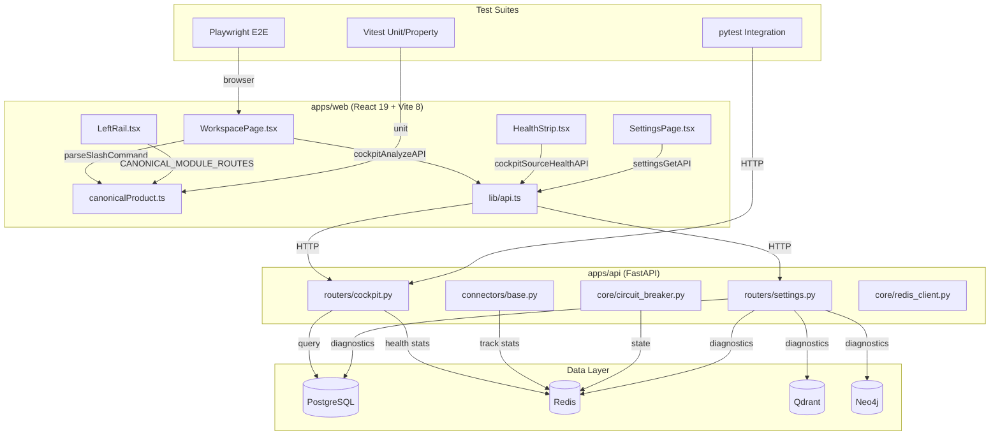
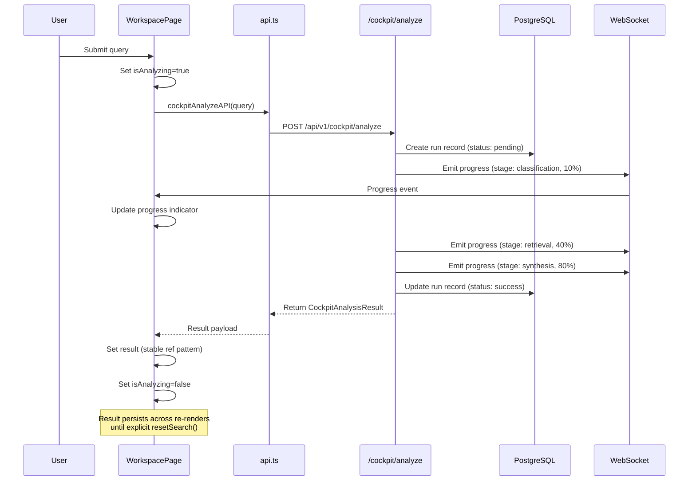

# Design Document — Final Product Hardening

## Overview

This design addresses 8 critical gaps preventing the Drug Designer platform from passing the §11 acceptance gates. The work spans frontend state management (cockpit query lifecycle), parser enhancement (inline slash commands), navigation cleanup (deprecated routes), contract normalization (FE↔BE), build stability (TypeScript), observability (connector health), acceptance testing (Playwright + pytest), and settings depth.

The architecture follows the existing patterns: React 19 with hooks for frontend state, FastAPI routers for backend endpoints, Redis for rolling metrics, PostgreSQL for persistent records, and the `canonicalProduct.ts` module as the single source of truth for routing and command definitions.

**Key Design Decisions:**
1. **useRef for result stability** — The cockpit result reset bug is caused by `useState` losing state on re-renders triggered by unrelated state changes. We stabilize by lifting the result into a ref-backed state pattern with explicit clear semantics.
2. **Regex-based inline parser** — The slash command parser is extended with a regex scan that finds `/command` tokens at any position, not just leading position.
3. **Data-driven navigation** — The LeftRail already derives from `CANONICAL_MODULE_ROUTES`; we ensure no additional hardcoded entries leak in and add redirect rules for all deprecated paths.
4. **Computation-only health stats** — Health badge color and stats aggregation are pure functions suitable for property-based testing.

## Architecture



### Data Flow: Cockpit Query Lifecycle (Stabilized)



## Components and Interfaces

### 1. Cockpit Query Lifecycle (WorkspacePage.tsx)

**Problem:** The `result` state resets when unrelated state changes trigger re-renders because the component re-initializes.

**Solution:** Use a stable state pattern where `result` is only cleared by explicit user action (`resetSearch()`), never by component lifecycle.

```typescript
// Stabilized state management pattern
interface CockpitQueryState {
  query: string;
  isAnalyzing: boolean;
  result: CockpitAnalysisResult | null;
  error: string | null;
  runId: string | null;
  progressStage: string | null;
  progressPercent: number;
  timeoutWarning: boolean;
}

// Actions that can modify state
type CockpitAction =
  | { type: "START_ANALYSIS"; query: string; runId: string }
  | { type: "PROGRESS"; stage: string; percent: number }
  | { type: "COMPLETE"; result: CockpitAnalysisResult }
  | { type: "ERROR"; error: string }
  | { type: "TIMEOUT" }
  | { type: "RESET" }
  | { type: "RESTORE"; result: CockpitAnalysisResult };
```

**Key invariant:** The `result` field is only set to `null` by the `RESET` action (explicit user action). No other state transition clears it.

### 2. Inline Slash Command Parser (canonicalProduct.ts)

**Current behavior:** `parseSlashCommand()` only detects commands at position 0.

**New behavior:** Scan the entire input for `/command` tokens using regex, extract the first match as primary command, and capture surrounding text as `additionalInstructions`.

```typescript
export interface InlineSlashParseResult {
  command: SlashCommandDefinition | null;
  argument: string;
  additionalInstructions: string;
  pendingCommands: SlashCommandDefinition[];
  originalQuery: string;
  normalizedQuery: string;
}

export function parseInlineSlashCommand(input: string): InlineSlashParseResult;
```

**Parsing algorithm:**
1. Normalize input via `normalizeCockpitQuery()`
2. Scan for all `/word` tokens using regex `(?:^|\s)(\/[a-z]+)(?:\s|$)`
3. For each match, check if it's a valid command in `SLASH_COMMANDS`
4. First valid match → primary command; subsequent → `pendingCommands`
5. Text before the first command + text after the argument → `additionalInstructions`
6. If no valid command found → return `{ command: null, argument: normalizedQuery, ... }`

### 3. Deprecated Route Cleanup (App.tsx + canonicalProduct.ts)

**Redirect map** derived from `LEGACY_ROUTE_DECISIONS`:

```typescript
// Routes that redirect to /workspace (or their canonicalPath)
const REDIRECT_ROUTES: Array<{ from: string; to: string }> = 
  LEGACY_ROUTE_DECISIONS
    .filter(d => d.action === "hide" || d.action === "merge")
    .map(d => ({ from: d.legacyPath, to: d.canonicalPath ?? "/workspace" }));
```

Each redirect triggers a toast: `"${label} has moved to ${canonicalLabel}"`

### 4. API Client Normalization (lib/api.ts)

**Contract rules:**
- One exported function per canonical endpoint
- Section comments matching module families
- Deprecated wrappers marked with `@deprecated` JSDoc and forwarding to canonical function
- All POST calls go through the shared `post<T>()` helper (already sets Content-Type)

**Canonical endpoint renames:**
| Legacy | Canonical | Action |
|--------|-----------|--------|
| `/targets/prioritize` | `/targets/rank` | Rename + backend alias |

### 5. Connector Health Computation (Pure Functions)

```typescript
export interface SourceHealthEntry {
  name: string;
  status: "healthy" | "degraded" | "error" | "unknown";
  avg_response_ms: number | null;
  p95_response_ms: number | null;
  errors_1h: number;
  ratelimit_hits_1h: number;
  last_checked: string;
  circuit_breaker_state: "closed" | "open" | "half_open";
}

export interface HealthSummary {
  total: number;
  healthy: number;
  degraded: number;
  error: number;
  unknown: number;
}

export type HealthBadgeColor = "green" | "yellow" | "red";

// Pure function — suitable for property-based testing
export function computeHealthBadgeColor(summary: HealthSummary): HealthBadgeColor;
export function computeHealthSummary(sources: SourceHealthEntry[]): HealthSummary;
export function deriveConnectorStatus(
  circuitBreakerState: string,
  errors1h: number,
  errorThreshold?: number
): "healthy" | "degraded" | "error";
```

### 6. Settings Platform (SettingsPage.tsx)

**Tab structure:**
```typescript
const SETTINGS_TABS = [
  "general",
  "sources", 
  "runtime",
  "models",
  "security",
  "storage",
  "accessibility",
  "diagnostics",
] as const;

type SettingsTab = typeof SETTINGS_TABS[number];
```

Each tab fetches live data from its corresponding backend endpoint on mount.

## Data Models

### Run Record (PostgreSQL)

```sql
CREATE TABLE cockpit_runs (
  id UUID PRIMARY KEY DEFAULT gen_random_uuid(),
  query TEXT NOT NULL,
  status VARCHAR(20) NOT NULL DEFAULT 'pending',
  created_at TIMESTAMPTZ NOT NULL DEFAULT NOW(),
  updated_at TIMESTAMPTZ NOT NULL DEFAULT NOW(),
  result_summary JSONB,
  error_message TEXT,
  provenance JSONB,
  user_id UUID REFERENCES users(id),
  project_id UUID REFERENCES projects(id)
);

CREATE INDEX idx_cockpit_runs_user_created 
  ON cockpit_runs(user_id, created_at DESC);
```

**Status transitions:** `pending` → `running` → `success` | `error` | `timeout`

### Progress Event (WebSocket)

```typescript
interface CockpitProgressEvent {
  run_id: string;
  stage: "classification" | "retrieval" | "enrichment" | "synthesis" | "scoring";
  percentage: number; // 0-100
  message: string;
  timestamp: string; // ISO 8601
}
```

### Handoff Payload Extension

```typescript
interface SharedHandoffPayload {
  // ... existing fields ...
  additionalInstructions?: string; // Natural language context from inline command
  pendingCommands?: Array<{
    command: string;
    argument: string;
  }>;
}
```

### Source Health Response

```typescript
interface SourceHealthResponse {
  sources: SourceHealthEntry[];
  summary: HealthSummary;
}
```

### Settings Tree

```typescript
interface SettingsTree {
  general: { project_name: string; default_limit: number; theme: string };
  sources: Array<{ id: string; name: string; enabled: boolean; api_key_set: boolean; health: string }>;
  runtime: { mode: string; engine: string; model: string; gpu_available: boolean };
  models: Array<{ name: string; version: string; size_gb: number; status: string }>;
  security: { auth_enabled: boolean; rbac_roles: string[]; session_ttl: number };
  storage: { cache_size_mb: number; retention_days: number };
  diagnostics: Record<string, { status: string; latency_ms: number }>;
}
```

## Correctness Properties

*A property is a characteristic or behavior that should hold true across all valid executions of a system — essentially, a formal statement about what the system should do. Properties serve as the bridge between human-readable specifications and machine-verifiable correctness guarantees.*

### Property 1: Result State Stability

*For any* completed `CockpitAnalysisResult` held in component state, any state update to unrelated fields (query text, progress index, elapsed time) SHALL NOT clear the result. The result is only cleared by an explicit `RESET` action.

**Validates: Requirements 1.3**

### Property 2: Inline Slash Command Extraction

*For any* input string containing a valid slash command token (from `SLASH_COMMANDS`) at any position (leading, middle, or trailing), the `parseInlineSlashCommand` function SHALL extract the correct `SlashCommandDefinition` and the text following the command as the `argument`.

**Validates: Requirements 2.1**

### Property 3: Handoff Payload Construction

*For any* valid inline parse result where `command` is non-null, the constructed `SharedHandoffPayload` SHALL contain: the command's `route` as `targetRoute`, the extracted `argument` as `query`, and the surrounding natural language text as `additionalInstructions`.

**Validates: Requirements 2.2**

### Property 4: No-Command Passthrough

*For any* input string that does NOT contain any token matching a command in `SLASH_COMMANDS`, the `parseInlineSlashCommand` function SHALL return `command: null` and the full normalized input as `argument`.

**Validates: Requirements 2.3**

### Property 5: Multi-Command Parsing

*For any* input string containing N ≥ 2 valid slash command tokens, the parser SHALL return the first valid command as `command` and all subsequent valid commands in `pendingCommands`, preserving their order of appearance.

**Validates: Requirements 2.5**

### Property 6: Deprecated Route Redirect

*For any* route path listed in `LEGACY_ROUTE_DECISIONS` with `action` equal to `"hide"`, navigating to that path SHALL result in a redirect to `/workspace` (or the specified `canonicalPath`) and SHALL trigger a toast notification.

**Validates: Requirements 3.3, 3.4**

### Property 7: API Client Endpoint Uniqueness

*For any* canonical backend endpoint path, the API client SHALL export exactly one wrapper function that calls that path. No two exported functions SHALL reference the same endpoint path.

**Validates: Requirements 4.2**

### Property 8: Health Stats Computation

*For any* list of response time samples (positive floats), `computeHealthStats` SHALL return an `avg_response_ms` equal to the arithmetic mean and a `p95_response_ms` equal to the value at the 95th percentile index of the sorted list.

**Validates: Requirements 6.2**

### Property 9: Circuit Breaker Status Mapping

*For any* connector whose circuit breaker state is `"open"`, the `deriveConnectorStatus` function SHALL return `"degraded"`. For state `"closed"` with errors below threshold, it SHALL return `"healthy"`.

**Validates: Requirements 6.3**

### Property 10: Health Badge Color Coding

*For any* `HealthSummary` where `healthy / total > 0.8`, `computeHealthBadgeColor` SHALL return `"green"`. Where `0.5 ≤ healthy / total ≤ 0.8`, it SHALL return `"yellow"`. Where `healthy / total < 0.5`, it SHALL return `"red"`.

**Validates: Requirements 6.6**

## Error Handling

### Cockpit Query Lifecycle

| Error Condition | Handling |
|----------------|----------|
| Backend returns HTTP 5xx | Set `error` state with message, update run record to `"error"`, show retry button |
| WebSocket disconnects during analysis | Fall back to polling `GET /cockpit/recent-runs` every 5s until run completes |
| Analysis exceeds 120s without progress | Set `timeoutWarning: true`, show timeout UI with retry/cancel |
| Invalid query (empty/whitespace) | Reject at input validation, no API call |
| Network failure | Catch in `post()` helper, surface error toast, preserve previous result |

### Slash Command Parser

| Error Condition | Handling |
|----------------|----------|
| Unrecognized `/token` | Ignore it (treat as literal text), continue scanning for valid commands |
| Multiple commands with conflicting routes | First command wins, rest go to `pendingCommands` |
| Command without argument | Valid — argument is empty string, additionalInstructions carries context |

### Connector Health

| Error Condition | Handling |
|----------------|----------|
| Redis unavailable | Return DB-only data with `null` for latency/error metrics |
| Connector has no Redis stats | Report status as `"unknown"` with null metrics |
| Circuit breaker in open state | Map to `"degraded"` status, include `retry_in_seconds` |

### Settings

| Error Condition | Handling |
|----------------|----------|
| Backend unreachable | Show cached last-known values with "stale" indicator |
| Invalid settings value | Backend validates and returns 422 with field-level errors |
| Partial save failure | Roll back to previous values, show error toast |

## Testing Strategy

### Property-Based Tests (Vitest + fast-check)

Property-based testing is appropriate for this feature because several components involve pure functions with clear input/output behavior and universal properties (parser, health computation, state machine).

**Library:** `fast-check` with Vitest
**Configuration:** Minimum 100 iterations per property test
**Tag format:** `Feature: final-product-hardening, Property {N}: {title}`

| Property | Target Function | Generator Strategy |
|----------|----------------|-------------------|
| 1: Result State Stability | `cockpitReducer` | Generate random `CockpitQueryState` with non-null result + random non-RESET actions |
| 2: Inline Command Extraction | `parseInlineSlashCommand` | Generate strings with embedded valid commands at random positions |
| 3: Handoff Payload Construction | `buildHandoffPayload` | Generate valid `InlineSlashParseResult` objects with non-null commands |
| 4: No-Command Passthrough | `parseInlineSlashCommand` | Generate strings guaranteed to NOT contain any SLASH_COMMANDS token |
| 5: Multi-Command Parsing | `parseInlineSlashCommand` | Generate strings with 2-4 valid command tokens at random positions |
| 6: Deprecated Route Redirect | Router config | Iterate all LEGACY_ROUTE_DECISIONS with action "hide" |
| 7: Endpoint Uniqueness | Static analysis of api.ts | Extract all endpoint paths, verify Set size equals array length |
| 8: Health Stats Computation | `computeHealthStats` | Generate arrays of 1-200 positive floats |
| 9: Circuit Breaker Mapping | `deriveConnectorStatus` | Generate all circuit breaker states × error count combinations |
| 10: Health Badge Color | `computeHealthBadgeColor` | Generate HealthSummary with random total/healthy/degraded/error counts |

### Unit Tests (Vitest)

- `parseSlashCommand()` — existing leading-slash behavior preserved (regression)
- `normalizeCockpitQuery()` — Greek letters, Unicode normalization, PDB/UniProt patterns
- `classifyCockpitQueryMode()` — all query mode classifications
- 13 acceptance gate query probes from §11.13 (example-based)
- Settings tab rendering with mock data
- LeftRail renders exactly 13 items (smoke)

### Integration Tests (pytest)

- `POST /api/v1/cockpit/analyze` — creates run record, returns full result
- `GET /api/v1/cockpit/recent-runs` — returns runs ordered by creation time
- `GET /api/v1/cockpit/source-health` — returns all registered connectors with stats
- `GET /api/v1/catalog/stats` — returns non-zero counts
- `GET /api/v1/settings` — returns full settings tree
- `GET /api/v1/runtime/status` — returns accurate runtime state
- Deprecated route aliases forward correctly

### End-to-End Tests (Playwright)

- **Project:** `acceptance-gates` (run via `npx playwright test --project=acceptance-gates`)
- 13 distinct test cases mapping to §11 gates
- Screenshots captured on failure
- Summary report with gate name, status, execution time
- Total suite target: < 10 minutes against live backend

### Build Verification

- `npm run build` exits with code 0 (CI gate)
- `tsc --noEmit` reports zero errors (CI gate)
- Bundle size < 15 MB (CI gate)
