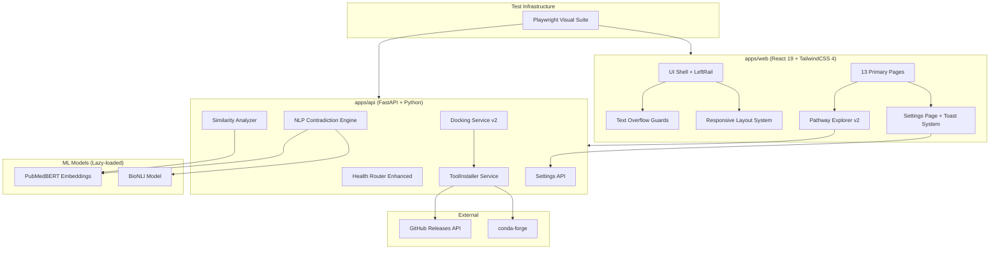
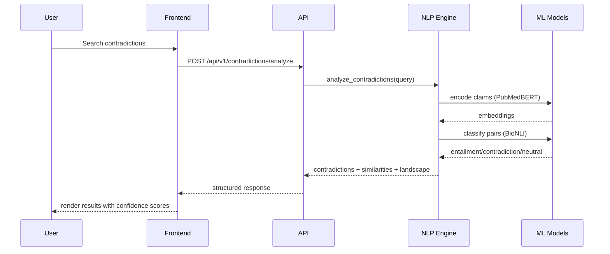

# Design Document: Platform Polish and Improvements

## Overview

This design addresses 10 requirements spanning UI polish, responsive layout, pathway page redesign, settings feedback, AutoDock Vina auto-installation, biomedical NLP-based contradiction/similarity detection, Playwright visual regression testing, and backend health verification. The goal is to transform the Drug Designer platform from a functional prototype into a polished, production-quality biomedical research tool.

**Key Design Decisions:**
1. **CSS-first overflow prevention** — Use TailwindCSS 4 utility classes (`truncate`, `line-clamp-*`, `overflow-x-auto`) applied systematically rather than per-component JavaScript solutions.
2. **Graceful NLP degradation** — The NLI/embedding pipeline falls back to the existing keyword heuristic when models are unavailable, ensuring zero-downtime deployments.
3. **Binary auto-installer as a service** — A `ToolInstaller` service handles OS detection, download, and permission management for Vina/fpocket with retry and manual fallback.
4. **Playwright over Cypress for visual testing** — Playwright provides native multi-viewport screenshot comparison and faster execution than Cypress for visual regression.

## Architecture



### High-Level Data Flow



## Components and Interfaces

### 1. Text Overflow Guard System (Frontend)

**Approach:** Apply a global set of TailwindCSS utility classes to all dynamic text containers.

```typescript
// Utility CSS classes applied globally via index.css and component patterns:
// .text-overflow-guard: overflow-hidden text-ellipsis whitespace-nowrap
// .text-clamp-2: line-clamp-2
// .text-clamp-3: line-clamp-3
// .table-scroll-container: overflow-x-auto -webkit-overflow-scrolling-touch

// Badge component pattern:
interface BadgeProps {
  value: string;
  maxChars?: number; // default 3
}

// When value.length > maxChars:
//   - Display truncated text with ellipsis
//   - Add title attribute with full value
//   - Wrap in Radix Tooltip for hover display
```

**Implementation locations:**
- `apps/web/src/index.css` — Add global overflow utility classes
- `apps/web/src/components/shell/LeftRail.tsx` — Badge truncation with tooltip
- All page components — Apply `truncate` / `line-clamp-*` to dynamic text containers
- All table wrappers — Add `overflow-x-auto` container

### 2. Responsive Layout System (Frontend)

**Approach:** Extend existing responsive CSS with systematic breakpoint handling.

```css
/* Breakpoint strategy (mobile-first enhancement of existing system): */
/* 320px: Base mobile — single column, no horizontal scroll */
/* 768px: Tablet — 2-column grids, sidebar collapses to hamburger */
/* 1024px: Desktop — 3+ column grids, full sidebar */
/* 1440px: Wide desktop — maximum content width */

/* Card grid responsive pattern: */
.card-grid {
  display: grid;
  gap: 16px;
  grid-template-columns: 1fr; /* mobile default */
}
@media (min-width: 768px) {
  .card-grid { grid-template-columns: repeat(2, 1fr); }
}
@media (min-width: 1024px) {
  .card-grid { grid-template-columns: repeat(3, 1fr); }
}
```

**LeftRail collapse** (already partially implemented):
- Below 768px: `transform: translateX(-100%)` with hamburger toggle
- Hamburger button visible via `.mobile-menu-btn` class (already in CSS)

### 3. Pathway Explorer v2 (Frontend)

**New features:**
- Pagination (25 results per source page)
- Side-by-side comparison diff view
- Persistent enrichment results
- Disease context annotations
- Export (SVG, PNG, JSON)

```typescript
// Pagination state
interface PaginationState {
  page: number;
  pageSize: number; // 25
  totalBySource: Record<SourceKey, number>;
}

// Comparison diff
interface PathwayDiff {
  sharedGenes: string[];
  uniqueToA: string[];
  uniqueToB: string[];
  sharedInteractions: Interaction[];
}

// Enrichment persistence API
// POST /api/v1/pathways/enrichment — run + persist
// GET /api/v1/pathways/enrichment/{id} — retrieve persisted results

// Export API
// POST /api/v1/pathways/export — { pathway_ids: string[], format: "svg"|"png"|"json" }
```

### 4. Settings Page Feedback System (Frontend)

```typescript
// Toast notification system
interface ToastConfig {
  type: "success" | "error" | "info" | "warning";
  title: string;
  description?: string;
  duration?: number; // ms, default 4000
}

// Theme application (< 200ms)
function applyTheme(theme: "light" | "dark" | "system") {
  document.documentElement.setAttribute("data-theme", theme);
  // CSS variables update instantly via attribute selector
}

// Font size preview (immediate, before save)
function previewFontSize(size: number) {
  document.documentElement.style.fontSize = `${size}px`;
}

// Reduced motion
function applyReducedMotion(enabled: boolean) {
  if (enabled) {
    document.documentElement.classList.add("reduce-motion");
  } else {
    document.documentElement.classList.remove("reduce-motion");
  }
}
```

### 5. ToolInstaller Service (Backend)

```python
# apps/api/services/tool_installer.py

class ToolInstaller:
    """Auto-downloads and installs computational chemistry binaries."""

    TOOLS_DIR = "apps/api/tools/bin"

    VINA_RELEASES_URL = "https://github.com/ccsb-scripps/AutoDock-Vina/releases"
    VINA_VERSION = "1.2.5"

    # Platform-specific binary mapping
    PLATFORM_MAP = {
        ("Linux", "x86_64"): "vina_1.2.5_linux_x86_64",
        ("Darwin", "x86_64"): "vina_1.2.5_mac_x86_64",
        ("Darwin", "arm64"): "vina_1.2.5_mac_arm64",
        ("Windows", "AMD64"): "vina_1.2.5_win32.exe",
    }

    async def detect_os(self) -> tuple[str, str]:
        """Return (system, machine) tuple."""
        import platform
        return platform.system(), platform.machine()

    async def get_download_url(self, tool: str) -> str:
        """Resolve download URL for the current platform."""
        system, machine = await self.detect_os()
        key = (system, machine)
        binary_name = self.PLATFORM_MAP.get(key)
        if not binary_name:
            raise UnsupportedPlatformError(f"No binary for {system}/{machine}")
        return f"{self.VINA_RELEASES_URL}/download/v{self.VINA_VERSION}/{binary_name}"

    async def install_tool(self, tool: str) -> InstallResult:
        """Download and install a tool binary."""
        # 1. Detect OS
        # 2. Resolve download URL
        # 3. Download with httpx (stream, verify checksum)
        # 4. Place in TOOLS_DIR with executable permissions (chmod 755)
        # 5. Verify binary runs (--version check)
        ...

    async def check_availability(self) -> dict[str, ToolStatus]:
        """Check which tools are available (PATH or tools/bin)."""
        ...

    async def ensure_tools_available(self) -> None:
        """Called on startup — install missing tools."""
        ...
```

**API Endpoint:**
```python
# POST /api/v1/design/plugins/install
# Body: { "tools": ["vina", "fpocket"] }
# Response: { "results": { "vina": { "status": "installed", "path": "..." }, ... } }
```

### 6. NLP Contradiction Detection Engine (Backend)

```python
# apps/api/services/nlp_contradiction_engine.py

class NLPContradictionEngine:
    """Biomedical NLP-based contradiction detection with graceful fallback."""

    def __init__(self):
        self._embedder: Optional[SentenceTransformer] = None
        self._nli_model: Optional[Pipeline] = None
        self._available = False

    async def initialize(self) -> None:
        """Lazy-load models. Sets _available = True on success."""
        try:
            from sentence_transformers import SentenceTransformer
            self._embedder = SentenceTransformer(
                "microsoft/BiomedNLP-BiomedBERT-base-uncased-abstract-fulltext"
            )
            from transformers import pipeline
            self._nli_model = pipeline(
                "text-classification",
                model="microsoft/BiomedNLI",
                device=-1  # CPU; use 0 for GPU
            )
            self._available = True
        except Exception as e:
            log.warning("NLP models unavailable, using keyword fallback", error=str(e))
            self._available = False

    def compute_similarity(self, text_a: str, text_b: str) -> float:
        """Compute cosine similarity between two biomedical texts."""
        if not self._available:
            return self._jaccard_fallback(text_a, text_b)
        embeddings = self._embedder.encode([text_a, text_b])
        from numpy import dot
        from numpy.linalg import norm
        return float(dot(embeddings[0], embeddings[1]) /
                     (norm(embeddings[0]) * norm(embeddings[1])))

    def classify_pair(self, premise: str, hypothesis: str) -> NLIResult:
        """Classify a claim pair as entailment/contradiction/neutral."""
        if not self._available:
            return self._keyword_fallback(premise, hypothesis)
        result = self._nli_model(f"{premise} [SEP] {hypothesis}")
        return NLIResult(
            label=result[0]["label"],  # entailment|contradiction|neutral
            confidence=result[0]["score"]
        )

    def extract_context(self, text: str) -> ExperimentalContext:
        """Extract experimental context using regex patterns."""
        # Reuses existing _extract_context() patterns
        ...

    def compute_confidence(self, nli_score: float, context_alignment: float,
                           source_quality: float) -> float:
        """Weighted confidence: 0.5*NLI + 0.3*context + 0.2*source."""
        return min(1.0, max(0.0,
            0.5 * nli_score + 0.3 * context_alignment + 0.2 * source_quality
        ))
```

**Model Selection Rationale:**
- **PubMedBERT** (`microsoft/BiomedNLP-BiomedBERT-base-uncased-abstract-fulltext`): Pre-trained on PubMed abstracts, best-in-class for biomedical sentence embeddings. Available via `sentence-transformers`.
- **BiomedNLI** (`microsoft/BiomedNLI`): Fine-tuned on biomedical NLI datasets (MedNLI + SciNLI). If unavailable, fallback to `cross-encoder/nli-deberta-v3-base` with domain adaptation.
- **Fallback**: Existing keyword heuristic in `contradiction_detector.py` with `_CONTRADICTION_PAIRS`.

### 7. Similarity Analyzer (Backend)

```python
# apps/api/services/similarity_analyzer.py

class SimilarityAnalyzer:
    """Biomedical evidence similarity detection and clustering."""

    def __init__(self, engine: NLPContradictionEngine, threshold: float = 0.7):
        self._engine = engine
        self._threshold = threshold

    async def find_similarities(
        self, claims: list[ClaimItem]
    ) -> SimilarityResult:
        """Compute pairwise similarities and cluster related claims."""
        # 1. Encode all claims
        # 2. Compute pairwise cosine similarity matrix
        # 3. Filter pairs above threshold
        # 4. Classify: shared_finding vs complementary_evidence
        # 5. Cluster using agglomerative clustering
        # 6. Generate representative summary per cluster
        # 7. Extract shared entities per cluster
        ...

    def classify_relationship(self, sim_score: float,
                              entities_a: set, entities_b: set) -> str:
        """Classify as shared_finding or complementary_evidence."""
        entity_overlap = len(entities_a & entities_b) / max(len(entities_a | entities_b), 1)
        if entity_overlap > 0.6 and sim_score > 0.8:
            return "shared_finding"
        return "complementary_evidence"

    def filter_results(self, results: list[SimilarityCluster],
                       entity_type: Optional[str] = None,
                       source_db: Optional[str] = None) -> list[SimilarityCluster]:
        """Filter clusters by entity type or source database."""
        ...
```

### 8. Health Router Enhancement (Backend)

```python
# Enhanced /api/v1/health endpoint
# Adds: PostgreSQL check, Redis check, Qdrant check, plugin status

async def health_v2() -> HealthResponse:
    checks = {}
    checks["postgresql"] = await _check_postgresql()
    checks["redis"] = await _check_redis()
    checks["qdrant"] = await _check_qdrant()
    checks["plugins"] = _check_plugins()  # vina, fpocket, rdkit

    failed = [k for k, v in checks.items() if v["status"] == "unavailable"]
    status = "ok" if not failed else "degraded"

    return HealthResponse(
        status=status,
        services=checks,
        timestamp=datetime.utcnow().isoformat(),
        failed_services=failed or None,
    )
```

### 9. Playwright Visual Test Suite

```typescript
// tests/visual/visual-regression.spec.ts

const PRIMARY_PAGES = [
  { name: "Cockpit", path: "/" },
  { name: "Evidence Search", path: "/evidence-search" },
  { name: "Entity Intelligence", path: "/entity-intelligence" },
  { name: "Knowledge Graph", path: "/knowledge-graph" },
  { name: "Pathways", path: "/pathways" },
  { name: "Structure", path: "/structure" },
  { name: "Design Studio", path: "/design" },
  { name: "Clinical Design", path: "/clinical-design" },
  { name: "SynthArena", path: "/syntharena" },
  { name: "Labs", path: "/labs" },
  { name: "Contradictions", path: "/contradictions" },
  { name: "PICO", path: "/pico" },
  { name: "Settings", path: "/settings" },
];

const VIEWPORTS = [
  { name: "desktop", width: 1440, height: 900 },
  { name: "tablet", width: 768, height: 1024 },
  { name: "mobile", width: 320, height: 568 },
];

// For each page × viewport:
// 1. Navigate to page
// 2. Wait for network idle
// 3. Capture full-page screenshot
// 4. Assert no horizontal overflow: page.evaluate(() =>
//      document.querySelectorAll('*').forEach(el =>
//        expect(el.scrollWidth).toBeLessThanOrEqual(el.clientWidth + 1)
//      ))
// 5. At mobile viewport: verify hamburger menu visible
// 6. At mobile viewport: verify no page-level horizontal scrollbar
```

## Data Models

### NLP Engine Models

```python
from pydantic import BaseModel, Field
from typing import Optional, Literal
from datetime import datetime

class NLIResult(BaseModel):
    label: Literal["entailment", "contradiction", "neutral"]
    confidence: float = Field(ge=0.0, le=1.0)
    method: Literal["nli_model", "keyword_heuristic"] = "nli_model"

class ExperimentalContext(BaseModel):
    study_type: str = "unknown"  # in_vivo, in_vitro, in_silico, clinical, meta_analysis
    model_organisms: list[str] = []
    cell_lines: list[str] = []
    methodologies: list[str] = []

class ContradictionResult(BaseModel):
    claim_a: str
    claim_b: str
    source_a: dict
    source_b: dict
    nli_result: NLIResult
    contradiction_type: str  # directional, temporal, magnitude, causal
    severity: Literal["high", "medium", "low"]
    confidence: float = Field(ge=0.0, le=1.0)
    context_a: ExperimentalContext
    context_b: ExperimentalContext
    temporal_note: Optional[str] = None
    resolution_suggestion: str = ""

class SimilarityCluster(BaseModel):
    cluster_id: str
    members: list[dict]
    member_count: int
    similarity_score: float = Field(ge=0.0, le=1.0)
    relationship_type: Literal["shared_finding", "complementary_evidence"]
    shared_entities: list[str]
    representative_summary: str
    consensus_strength: Literal["strong", "moderate", "weak"]

class EvidenceLandscape(BaseModel):
    total_sources_analyzed: int
    contradictions: list[ContradictionResult]
    similarities: list[SimilarityCluster]
    overall_consensus: Literal["strong", "moderate", "weak", "conflicted"]
    method_used: Literal["nlp", "keyword_fallback"]

class ToolStatus(BaseModel):
    name: str
    status: Literal["available", "not_detected", "installing", "install_failed"]
    version: str = ""
    path: str = ""
    error: Optional[str] = None
    install_hint: str = ""

class InstallResult(BaseModel):
    tool: str
    status: Literal["installed", "already_available", "failed"]
    path: str = ""
    error: Optional[str] = None
    duration_seconds: float = 0.0

class HealthResponse(BaseModel):
    status: Literal["ok", "degraded", "error"]
    services: dict[str, dict]
    timestamp: str
    failed_services: Optional[list[str]] = None

class StructuredError(BaseModel):
    error_code: str
    message: str
    suggested_remediation: str
    service: Optional[str] = None
    retry_after_seconds: Optional[int] = None
```

### Pathway Enrichment Persistence

```python
class PathwayEnrichmentResult(BaseModel):
    id: str  # UUID
    user_id: str
    gene_list: list[str]
    results: dict  # enrichment output by source
    created_at: datetime
    expires_at: Optional[datetime] = None
```

### Docking Validation Schema

```python
class DockingRequest(BaseModel):
    receptor_path: str  # Required: PDB/PDBQT file path
    ligand_path: str    # Required: PDBQT/SDF file path
    center: list[float] = Field(min_length=3, max_length=3)  # [x, y, z]
    box_size: list[float] = Field(min_length=3, max_length=3)  # [sx, sy, sz]
    engine: str = "vina"
    exhaustiveness: int = Field(default=8, ge=1, le=64)
    num_modes: int = Field(default=9, ge=1, le=20)
    energy_range: float = Field(default=3.0, ge=1.0, le=10.0)
```

## Correctness Properties

*A property is a characteristic or behavior that should hold true across all valid executions of a system — essentially, a formal statement about what the system should do. Properties serve as the bridge between human-readable specifications and machine-verifiable correctness guarantees.*

### Property 1: Badge Truncation

*For any* string value longer than 3 characters displayed in a navigation badge, the rendered badge text should be truncated and a tooltip containing the full original value should be accessible.

**Validates: Requirements 1.2**

### Property 2: Pagination Controls Appear for Large Result Sets

*For any* pathway search result set where a single source returns more than 25 results, the UI should render pagination controls (next, previous, page number indicators).

**Validates: Requirements 4.1**

### Property 3: Enrichment Persistence Round-Trip

*For any* valid gene list submitted for enrichment analysis, persisting the results and then retrieving them should produce equivalent enrichment data.

**Validates: Requirements 4.3**

### Property 4: OS Detection Maps to Correct Download URL

*For any* supported operating system and architecture combination (Linux/x86_64, Darwin/x86_64, Darwin/arm64, Windows/AMD64), the `get_download_url` function should return a valid URL pointing to the platform-specific binary on the GitHub releases page.

**Validates: Requirements 6.3**

### Property 5: Docking Input Validation Rejects Incomplete Requests

*For any* docking request missing one or more required fields (receptor_path, ligand_path, center coordinates, box dimensions), the system should return a validation error without attempting to execute the docking engine.

**Validates: Requirements 6.7**

### Property 6: Vina Output Parsing Extracts Complete Pose Data

*For any* valid AutoDock Vina PDBQT output file containing MODEL/REMARK VINA RESULT lines, parsing should produce a list of poses where each pose contains rank (int), affinity_kcal (float), rmsd_lb (float), and rmsd_ub (float).

**Validates: Requirements 6.8**

### Property 7: Similarity Computation Produces Valid Cosine Scores

*For any* two non-empty biomedical text strings, the similarity computation should return a float value in the range [-1.0, 1.0] (cosine similarity), and for identical strings should return a value > 0.99.

**Validates: Requirements 7.1, 8.1**

### Property 8: NLI Classification Returns Valid Labels

*For any* pair of non-empty biomedical claim strings, the NLI classifier should return a label that is exactly one of {"entailment", "contradiction", "neutral"} and a confidence score in [0.0, 1.0].

**Validates: Requirements 7.2**

### Property 9: Experimental Context Extraction

*For any* biomedical text containing known context markers (study type keywords, organism names, cell line identifiers, methodology terms), the extraction function should identify at least one matching field in the returned ExperimentalContext.

**Validates: Requirements 7.4**

### Property 10: Evidence Clustering Groups Similar Items

*For any* set of evidence items where at least two items have pairwise cosine similarity above the configured threshold, those items should appear in the same cluster, and each cluster should have a non-empty representative summary.

**Validates: Requirements 7.6, 8.4**

### Property 11: Contradiction Confidence Score Bounds

*For any* detected contradiction, the assigned confidence score should be a float in [0.0, 1.0], computed as a weighted combination of NLI probability, context alignment, and source quality.

**Validates: Requirements 7.7**

### Property 12: Similarity Relationship Classification

*For any* claim pair with cosine similarity above the configured threshold, the system should classify the relationship as exactly one of {"shared_finding", "complementary_evidence"}.

**Validates: Requirements 8.2**

### Property 13: Biomedical Entity Extraction

*For any* biomedical text, the entity extraction function should return a (possibly empty) list of recognized entities, where each entity has a type from {gene, protein, drug, disease, pathway} and a non-empty name string.

**Validates: Requirements 8.3**

### Property 14: Similarity Filtering Correctness

*For any* entity type filter or source database filter applied to similarity results, all returned clusters should contain only members matching the specified filter criteria.

**Validates: Requirements 8.6**

### Property 15: No Element Horizontal Overflow

*For any* page in the application rendered at any of the three test viewports (1440px, 768px, 320px), no DOM element should have scrollWidth exceeding clientWidth by more than 1 pixel.

**Validates: Requirements 9.3, 9.5**

### Property 16: Structured Error Response Format

*For any* API request that fails due to a backend service being unavailable, the error response should contain the fields: error_code (non-empty string), message (non-empty string), and suggested_remediation (non-empty string).

**Validates: Requirements 10.4**

## Error Handling

### Frontend Error Handling

| Scenario | Handling |
|----------|----------|
| Settings save fails | Display error toast with failure reason; retain unsaved form state |
| Backend unavailable | Show degraded status indicator on affected page; offer retry |
| NLP models unavailable | Display "Results from keyword analysis" indicator; no error shown to user |
| Pathway search timeout | Show timeout message with retry button |
| Theme switch fails | Silently fall back to system theme |
| Export fails | Toast with error; suggest retry or alternative format |

### Backend Error Handling

| Scenario | Handling |
|----------|----------|
| Tool download fails (network) | Log error, mark plugin as "install_failed", return manual instructions |
| Tool download fails (permissions) | Log error, suggest running with elevated permissions |
| NLI model load fails | Set `_available = False`, all calls use keyword fallback |
| Docking timeout (600s) | Kill subprocess, return partial log, mark run as "timeout" |
| Database connection lost | Return `StructuredError` with retry_after_seconds |
| Qdrant unavailable | Degrade similarity to Jaccard fallback, log warning |
| Health check component fails | Report as "degraded" (not "error"), include specific failure |

### Structured Error Response Pattern

```python
# All API errors return this format when a service is unavailable:
{
    "error_code": "SERVICE_UNAVAILABLE",
    "message": "PostgreSQL connection failed",
    "suggested_remediation": "Check database connection settings or retry in 30 seconds",
    "service": "postgresql",
    "retry_after_seconds": 30
}
```

## Testing Strategy

### Unit Tests (Vitest for frontend, pytest for backend)

**Frontend:**
- Badge truncation logic
- Theme application function
- Pagination state management
- Pathway diff computation (shared/unique genes)
- Toast notification rendering

**Backend:**
- `ToolInstaller.detect_os()` → correct platform key
- `ToolInstaller.get_download_url()` → valid URL for each platform
- `DockingService._parse_vina_output()` → correct pose extraction
- `NLPContradictionEngine.compute_confidence()` → bounded [0, 1]
- `NLPContradictionEngine.extract_context()` → correct pattern matching
- `SimilarityAnalyzer.classify_relationship()` → correct label
- `SimilarityAnalyzer.filter_results()` → only matching items returned
- Health endpoint returns correct status for each subsystem state

### Property-Based Tests (fast-check for frontend, Hypothesis for backend)

**Configuration:** Minimum 100 iterations per property test.

Each property test references its design document property with tag format:
**Feature: platform-polish-and-improvements, Property {N}: {title}**

**Backend properties (Hypothesis):**
- Property 4: OS detection mapping
- Property 5: Docking input validation
- Property 6: Vina output parsing
- Property 7: Similarity computation bounds
- Property 8: NLI classification labels
- Property 9: Context extraction
- Property 10: Clustering behavior
- Property 11: Confidence score bounds
- Property 12: Relationship classification
- Property 14: Filtering correctness
- Property 16: Structured error format

**Frontend properties (fast-check):**
- Property 1: Badge truncation
- Property 2: Pagination controls
- Property 15: No element overflow (via Playwright assertions)

### Integration Tests

- Settings save → toast → persistence round-trip
- Pathway enrichment → persist → reload → retrieve
- Tool installation with mocked HTTP (success and failure paths)
- Health endpoint with various subsystem states
- Contradiction detection with NLP models available vs fallback

### Visual Regression Tests (Playwright)

- 13 pages × 3 viewports = 39 screenshot baselines
- Overflow assertion on every page/viewport combination
- LeftRail collapse verification at mobile viewport
- No horizontal scrollbar at 320px
- Full suite completes within 120 seconds

### Test Library Choices

| Layer | Library | Rationale |
|-------|---------|-----------|
| Frontend unit | Vitest + @testing-library/react | Already in package.json |
| Frontend PBT | fast-check | Standard PBT for TypeScript |
| Backend unit | pytest + pytest-asyncio | Standard for FastAPI |
| Backend PBT | Hypothesis | Standard PBT for Python |
| Visual regression | Playwright | Multi-viewport screenshots, overflow detection |
| E2E | Playwright | Replaces Cypress for visual tests; Cypress retained for interaction E2E |
